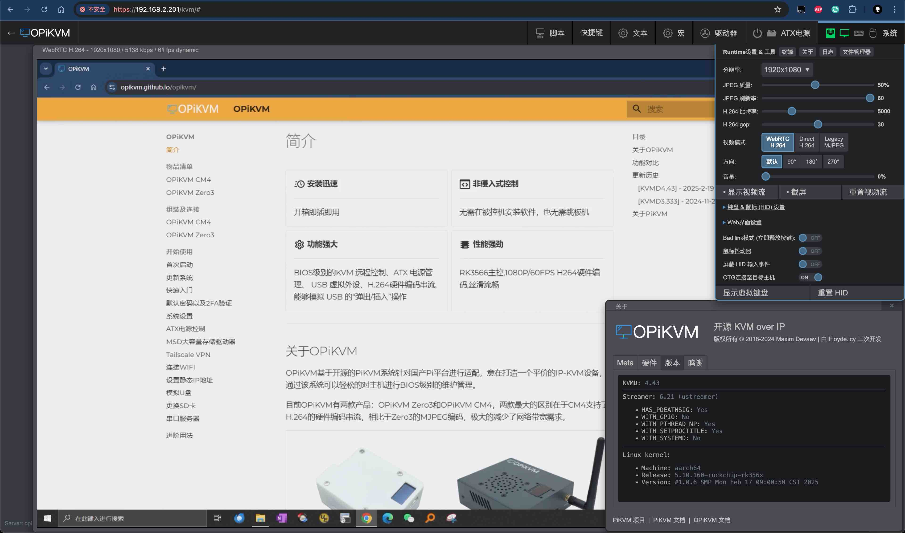

# OPiKVM CM4 快速入门

{ width="450px" }

OPiKVM CM4 是一个功能丰富的基于 Orange Pi 的 KVM over IP 设备。它允许您开启/关闭或重启计算机、配置 UEFI/BIOS，甚至使用虚拟 CD-ROM 或闪存驱动器重新安装操作系统。

OPiKVM CM4 可以模拟键盘、鼠标和显示器，然后在 Web 浏览器中呈现，仿佛您直接在远程系统上工作一样。

-----

## 包装内容

- OPiKVM CM4
- 32G Micro SD 卡
- ATX 控制小板
- ATX 连接跳线
- 1 根 ATX 线（ RJ45网线 ）
- 1 根 HDMI 高清线
- 2 根 USB-C 转 USB-A 线（ 白色供电 / 黑色 OTG ）
- 5V 3A 电源适配器
- 棒状天线

-----

## 接口

=== "前视图"

    { width="450px" }

    1. USB-C 电源输入 5V 3A
    2. USB 2.0 端口
    3. USB 3.0 端口
    4. RJ45 1000Mb 以太网端口

=== "后视图"

    { width="450px" }

    1. RJ45 ATX 控制端口
    2. HDMI 视频输入端口
    3. USB-C 2.0 OTG 连接器
    4. WI-FI 天线安装底座

=== "右视图"

    { width="450px" }

    1. Micro SD 卡槽
    2. HDMI 视频输出端口

=== "顶部视图"

    { width="450px" }

    1. OLED显示屏

-----

## 电缆连接

在启动设备之前，先连接好所有电缆。

### 网络

{ width="450px" }

使用 RJ45 网线将 **Ethernet** 连接到网络。

除此之外还有以下二种方法可以将OPiKVM接入到网络中,你可以根据你的实际情况选择不同的方法,具体操作步骤请参考[如何接入网络](network.md)

- [Wi-Fi连接](network.md#wi-fi)

- [USB共享网络](network.md#usb)

### HDMI 和 USB-C

{ width="450px" }

**HDMI IN** 和 **OTG** 端口（USB 模拟）应连接到被控主机的显示输出和 USB接口。

请确保 OPiKVM 和计算机之间没有 USB 集线器，因为某些 UEFI/BIOS 无法在启动阶段检测到集线器。

**可选：** 您可以连接 **[ATX](atx_board.md)** 来控制被控机的电源。

-----

## 开机

{ width="450px" }

OPiKVM CM4 配备 USB-C 5V / 3A 的电源适配器，请使用白色的 USB-A 转 USB-C 的数据线连接适配器

请尽量避免在另外两个 USB-A 端口上施加过大功率的负载。

请 **勿** 阻塞设备两侧的通风孔。

打开电源后，PiKVM OS 会对存储卡执行所有必要的操作。这个过程需要几分钟。请 **勿** 在设备首次启动完成之前关闭电源。启动完成后，OPiKVM 将在内置显示屏上显示欢迎信息。

-----

## 连接和设置

### 显示器设置

远程计算机的操作系统默认将 OPiKVM 视为附加显示器，并以扩展模式使用。因此，当您首次连接时，您会看到空白桌面。

为避免这种情况，请进入远程计算机操作系统的显示设置，启用外部显示器的镜像模式，操作系统将识别 OPiKVM 为外部显示器。请参考操作系统的文档来完成该设置（通常windows系统下的该设置快捷键为 Win + P 键，然后选择 **复制** ）。

### 访问 OPiKVM

默认情况下，OPiKVM 通过 DHCP 获取动态 IP 地址，并在 OLED 显示屏的顶部显示该地址：

```console
end1:192.168.0.26
CPU: 4% | MEM: 35%
状态:正常 | 40.0 C
(|) 0d 0h 34m
```

### 访问 PiKVM

假设 OPiKVM 已接收到地址 `192.168.2.201`。

在浏览器的地址栏中输入 URL 并按 **回车**：`https://192.168.2.201/`。

{ width="450" }

输入默认凭证并点击 **登录**：

- 用户名：`admin`
- 密码：`admin`
- 2FA 代码：默认禁用，跳过此字段

您将看到 OPiKVM 的初始仪表板界面，在这里您可以访问远程主机、连接 OPiKVM 终端命令行，或者退出：

{ width="450" }

### 更改默认密码

出于安全考虑，建议在首次运行 OPiKVM 后立即更改默认密码。

!!! danger "密码非常重要！"
    请确保更改 **两个** 密码：Web UI 访问密码和 Linux 超级用户（root）密码。

操作步骤：

1. 在初始仪表板界面，点击 **Terminal** 按钮打开 Web 终端。您将看到如下命令行界面：

    { width="450" }

2. 获取超级用户权限：

    ```console
    su -
    ```

    当提示输入密码时，输入 `orangepi`。

3. 更改超级用户密码：

    ```console
    [root@opi-kvm ~]# passwd root
    ```

    输入新密码，再次确认密码后按 **回车**，您将看到以下提示：

    ```console
    passwd: password updated successfully
    ```

4. 更改 Web 访问密码：

    ```console
    [root@opi-kvm ~]# kvmd-htpasswd set admin
    ```

    输入新密码，再次确认密码后按 **回车**。

5. 按 **Ctrl+D** 或输入 "exit" 并按 **回车** 来退出 root 权限。

6. 返回浏览器中的上一页，您将回到初始仪表板界面。

### 访问远程系统

1. 在初始仪表板界面，点击 **KVM** 按钮来访问远程主机。

2. 现在，您应该能够看到主机系统的显示，并通过键盘和鼠标进行远程操作。

    { width="450" }

-----

## 重要后续步骤

- **了解 OPiKVM Web UI**：阅读 [此帮助部分](webui.md)，以更好地了解 Web 用户界面的所有功能。

- **设置 [ATX 连接](atx_board.md)**，如果您需要控制远程系统的电源。
