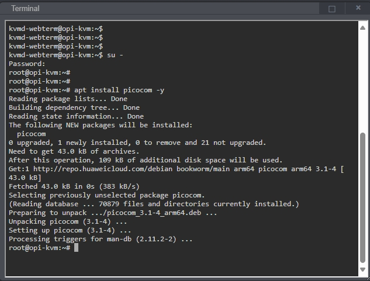
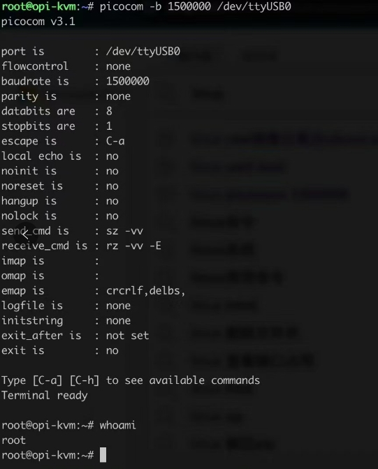

# 如何使OPiKVM成为串口服务器

OPiKVM预留了两个USB端口,一个为USB2.0,一个为USB3.0,使OPiKVM可以在外接USB转串口(CH340等等)的情况下，与目标主机进行串口的维护操作

* 打开`终端`输入以下指令在OPiKVM上安装picocom软件

```bash
su - #输入root密码切换至管理员权限
apt install picocom -y
```

{:width="800px" .off-glb}

* 插入USB转串口设备，查看dev,一般为/dev/ttyUSB0,使用picocom连接串口

!!!tip "picocom -b #biterate /dev/ttyUSB0"

```bash
ls -l /dev/ttyUSB*

picocom -b 15000000 /dev/ttyUSB0
```

{:width="800px" .off-glb}
