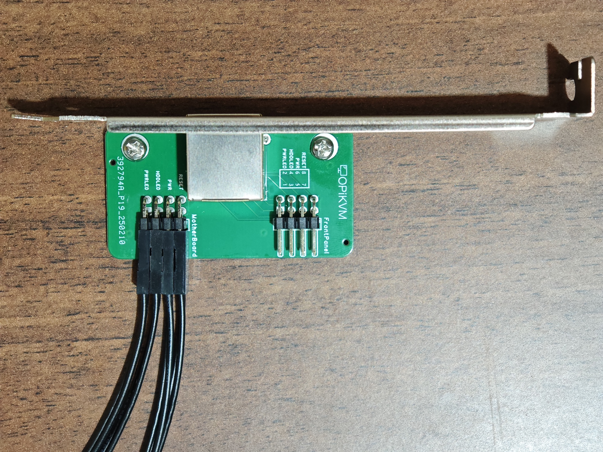
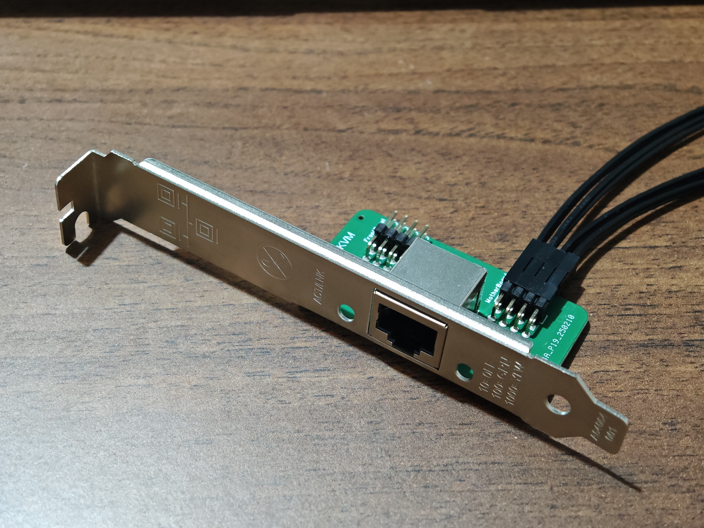
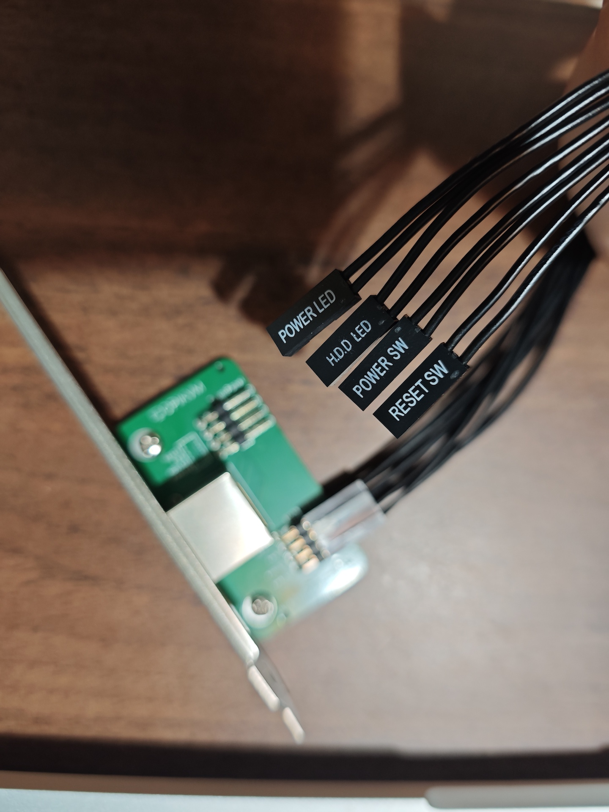

# ATX 控制板

为了管理计算机的电源，您需要在机箱内部安装 ATX 转接板，并将其连接到主板。主板到 ATX 转接板之间有4对母对母杜邦线，而 ATX 转接板到前面板之间也有4对母对母的杜邦线。ATX 转接板上有两排引脚，上端为连接前面板，下端为连接主板

!!! warning "Apple 的 Mac 计算机不兼容 ATX，因为它们缺少所需的 ATX 引脚，这仅适用于 PC 服务器和台式机。"

## 详细安装说明

1. 将杜邦线连接到 ATX 板，上端一排连接到前面板，另一排连接到主板。为了将 ATX 控制板固定在机箱内，您可以选择 Intel 9301CT 网卡的挡板。按如下图片组装所有部件。

    ??? example

        

        

2. 找到主板上负责连接机箱前面板按钮和 LED 的引脚。通常，主板上的电缆和连接器都有标注。如果不确定，请查阅主板的文档。

3. 根据 ATX 转接板上的标签连接前面板到 ATX 转接板上端的杜邦线。

4. 使用 ATX 转接板的杜邦线，将其连接到主板开关机以及 LED 跳线。查阅主板文档，了解主板上的哪个引脚连接到 ATX 转接板上的哪个引脚。有时这些信息会印在主板上。

    ??? example

        

5. 将 ATX 控制板安装到机箱的 PCI 插槽中，并用螺丝固定，或者根据您的需求使用其他安装方式。

6. 使用直通网线（8 芯）将 ATX 控制板连接到 PiKVM。
