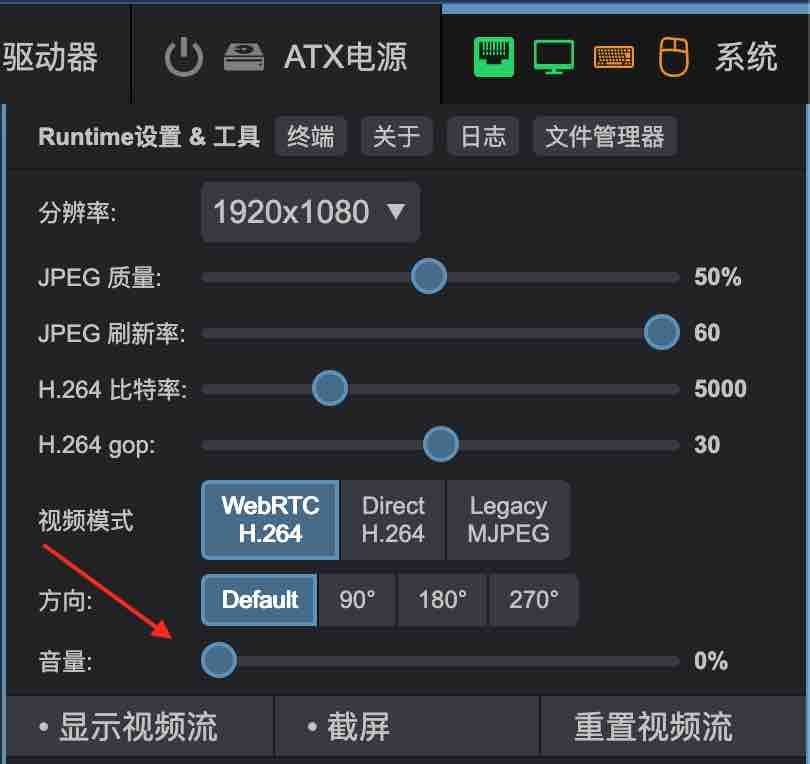
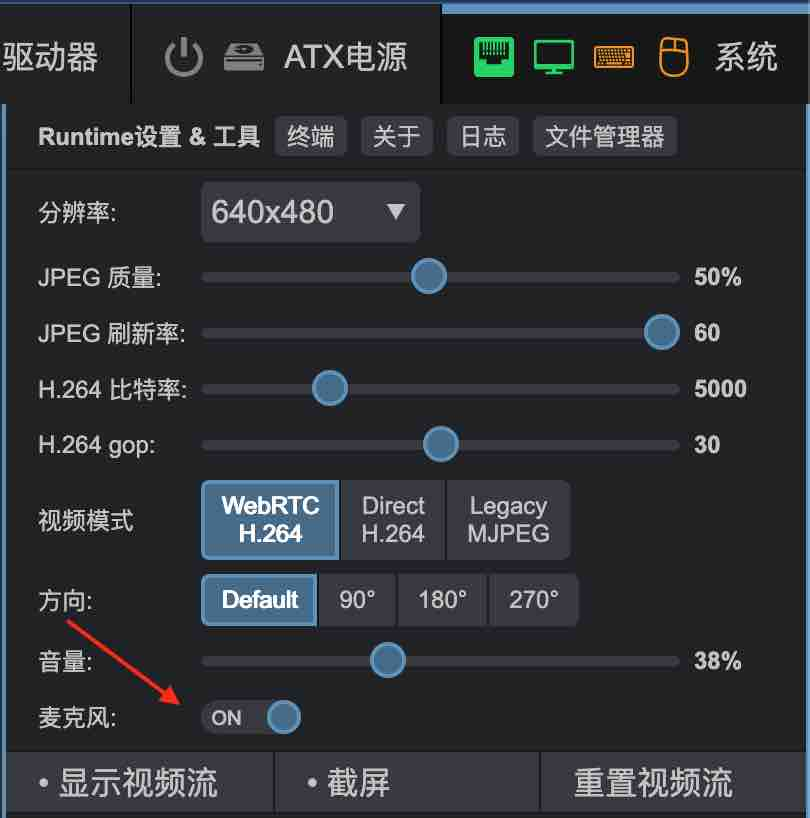

# 双向音频

OPiKVM CM4 设备提供了独有的音频传输功能，
包括 **双向** 通过浏览器直接进行麦克风通信。

传入的音频流通过 HDMI 从目标主机捕获，传出的音频流被传输到模拟的 USB 麦克风。
这使得用户在远程主机上使用语音应用程序的体验更加接近本地操作。

!!! note

    * VNC不支持音频，只能在 [WebRTC](video.md) 模式下的 Web UI 中工作。

-----

## 扬声器-输入音频

目标主机会决定是否能够通过 HDMI 输出音频。每个操作系统的做法不同。
一般来说，确保在混音器中选择 HDMI 作为音频输出。

OPiKVM 支持立体声模式，支持任何标准的比特率和频率，如 32/44.1/48 kHz 和 16/24 位。

* **Mac OS** 通常会自动识别 HDMI 作为音频输出设备，
    但你可以在设置中明确指定。

* **Windows** 需要明确指定音频输出设备。

* 在 **Linux** 上，具体取决于你使用的发行版。在过去，音频需要进行一系列复杂的配置。
    目前，Pipewire 或 Pulseaudio 应该就足够了。
    只需在混音器中将 HDMI 设置为音频接收端。

要在 OPiKVM Web UI 中接收音频，请进入 **系统** 菜单并将视频模式切换为 `WebRTC`。
如果一切正常，将会显示音量滑块。将音量调节为非零值。
视频流将重新启动，你应该开始听到目标主机的声音。

{:width="350px" .off-glb}

如果音量滑块设置为零，PiKVM 不会接收音频流以节省流量，
而目标主机仍然认为 HDMI 可用作为音频输出设备。

另外，当页面重新加载时，音量滑块将重置为零。
由于浏览器限制，无法保存此设置，这样可以防止网页在打开后立即播放音频，以保护用户免受烦人的广告干扰。

-----

## 麦克风-输出音频 { #microphone-outgoing-audio }

OPiKVM 能够在目标主机上模拟一个 USB 麦克风，将你的语音从浏览器传输到主机。
此功能默认禁用，以保持向后兼容。

{!_usb_limits.md!}

??? example "启用 USB 麦克风"

    1. 在 `/etc/kvmd/override.yaml` 中添加配置：

        ```yaml
        otg:
            devices:
                audio:
                    enabled: true
        ```

    2. 执行重启：

        ```console
        [root@opi-kvm ~]# reboot
        ```

要在 OPiKVM Web UI 中接收和传输音频，请进入 **系统** 菜单并将视频模式切换为 `WebRTC`。
如果一切正常，将会显示音量滑块和额外的麦克风开关。
将音量调节为非零值，然后切换麦克风开关。
浏览器将请求使用麦克风的权限，请允许。

{:width="350px" .off-glb}

麦克风开关的状态将保存在浏览器的本地设置中。
如果音量设置为零，麦克风信号将不会被传输。

!!! warning "USB 兼容性"

    这个功能是一个非常新的特性，因此我们不确定它会对与 BIOS 和 UEFI 的交互产生多大影响。

    如果你在启用 USB 麦克风后失去了访问 BIOS 或从 OPiKVM 大容量存储启动操作系统的能力，
    请尝试并 [告诉我](https://github.com/floydelcy/kvmd/issues)。

-----

## 故障排除

* 如果浏览器没有播放声音或没有显示音频滑块，尝试更换浏览器
    或者以无痕模式运行，避免使用扩展插件。Google Chrome 是最佳选择。

* 检查日志：`journalctl -u kvmd-janus`
