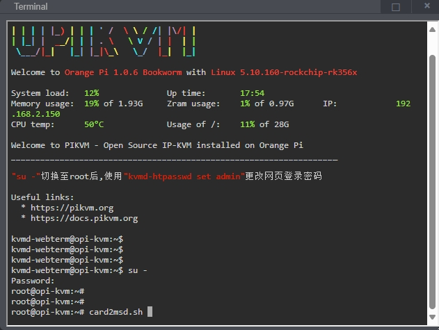

# 更换SD卡

如果您需要更换SD卡,在插入新的SD卡后需对新的SD卡进行格式化才能使MSD分区识别新的SD卡

* 打开`系统 -> 终端`,执行以下命令对新插入的SD卡进行格式化分区

```bash
su - #输入root密码切换至管理员权限

card2msd.sh #执行此命令对SD卡进行格式化

reboot #重启生效
```

{:width="800px" .off-glb}