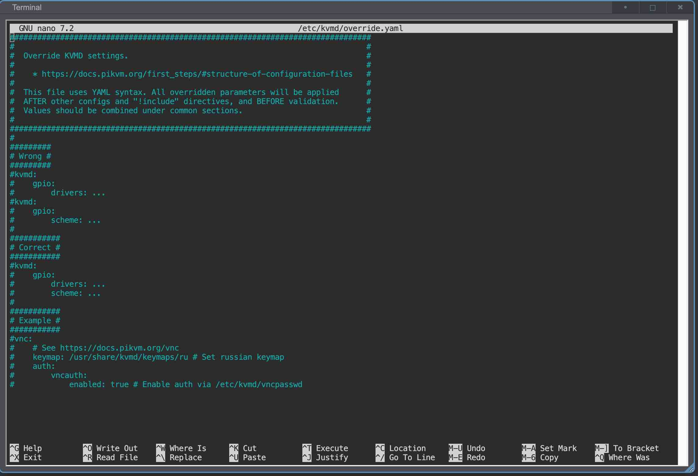
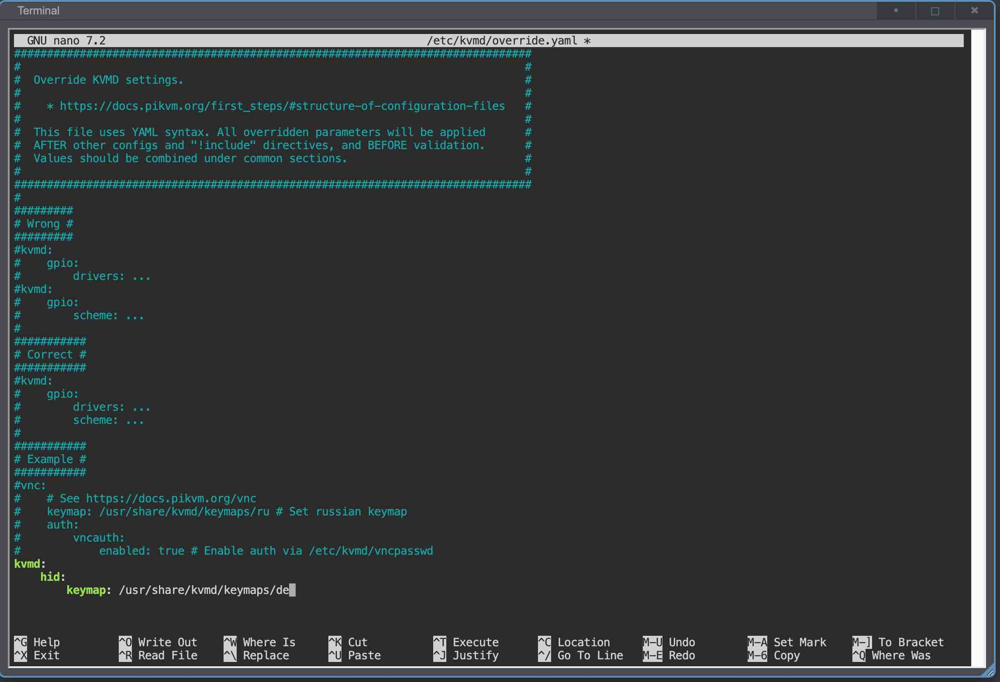

PiKVM OS 提供了多种底层参数可供自定义：如 `kvmd` 守护进程的超时时间、模拟键盘的默认键盘映射、VNC 会话的滚动速率、日志格式等。要修改它们，需通过覆盖默认配置来实现。

-----

## PiKVM OS 的配置文件覆盖机制

所有默认配置保存在 `/etc/kvmd/main.yaml` 中，但**切勿直接编辑此文件**。若要覆盖默认值，请在 `/etc/kvmd/override.yaml` 中进行修改。

系统启动时会先加载 `main.yaml`，然后再合并 `override.yaml` 中的配置。这种方法能安全分离默认设置与自定义配置。

## `override.yaml` 的格式

* `/etc/kvmd/override.yaml` 采用标准 YAML 语法，所有配置均以键值对（key-value pairs）形式存储。

    参考此示例：

    ```yaml
    file: /etc/kvmd/ipmipasswd
    ```

* 其中 `file` 是键（配置项名称），冒号后面跟的是它的值 `/etc/kvmd/ipmipasswd`。

    YAML 支持多级嵌套，例如：

    ```yaml
    ipmi:
        auth:
            file: /etc/kvmd/ipmipasswd
    ```

    请确保使用 **四个空格** （勿用制表符进行缩进）。

* 无需复制整个配置树即可修改单个设置。例如仅需修改 `timeout` 设置时，只需包含其父级键 vnc 和 kvmd：

    ```yaml
    vnc:
        kvmd:
            timeout: 7.0
    ```

    以 `#` 开头的行会被视为注释，可用于说明修改原因：

    ```yaml
    # 2025-05-08: changed the default timeout to 7.0 after some troubleshooting.
    vnc:
        kvmd:
            timeout: 7.0
    ```

    也可在行尾添加内联注释：

    ```yaml
    vnc:
        kvmd:
            timeout: 7.0 #this seems to work better
    ```

下面我们演示如何将默认键盘映射改为德语，仅作示例。

1. 编辑 `override.yaml`

    使用 `nano`（或你喜欢的编辑器）打开 `/etc/kvmd/override.yaml`：

    ```sh
    [root@opi-kvm ~]# nano /etc/kvmd/override.yaml
    ```

    `nano` 提供控制台界面，会在终端中显示文件内容：

    {:width="800px" .off-glb}

    滚动至文件底部（使用 **Ctrl+End**、**PageDown** 或 **↓** 键），添加：

    ```yaml
    kvmd:
        hid:
            keymap: /usr/share/kvmd/keymaps/de
    ```

    注意使用四个空格进行缩进

2. 保存并退出

    在 nano 中，按 **Ctrl+O** 保存，按 **Ctrl+X** 退出。

    {:width="800px" .off-glb}

    `^` 代表 Windows 和 Linux 上的 **Ctrl**，在 macOS 上代表 **Cmd**。`M` 代表 **Alt**。

3. 验证配置语法

    执行以下命令检查语法错误：

    ```sh
    [root@opi-kvm ~]# kvmd -m
    ```

    若写错（如用分号替代冒号），会看到类似错误：

    ```sh
    ConfigError: The node 'vnc' must be a dictionary
    ```

    纠正后再次运行，直到不报错为止。

## 重启 PiKVM

最后，重启设备以使新配置生效：

```sh
[root@opi-kvm ~]# reboot
```

设备重启后，覆盖的设置即刻生效。
