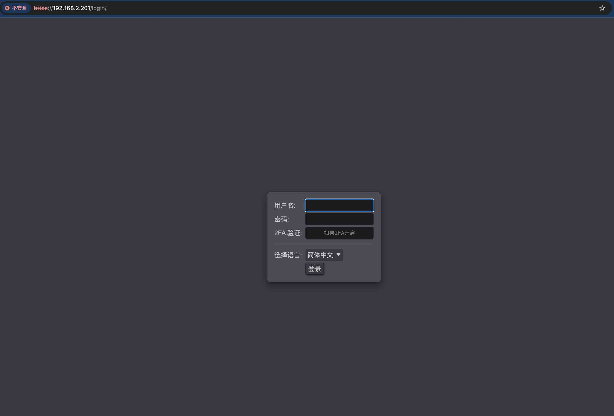
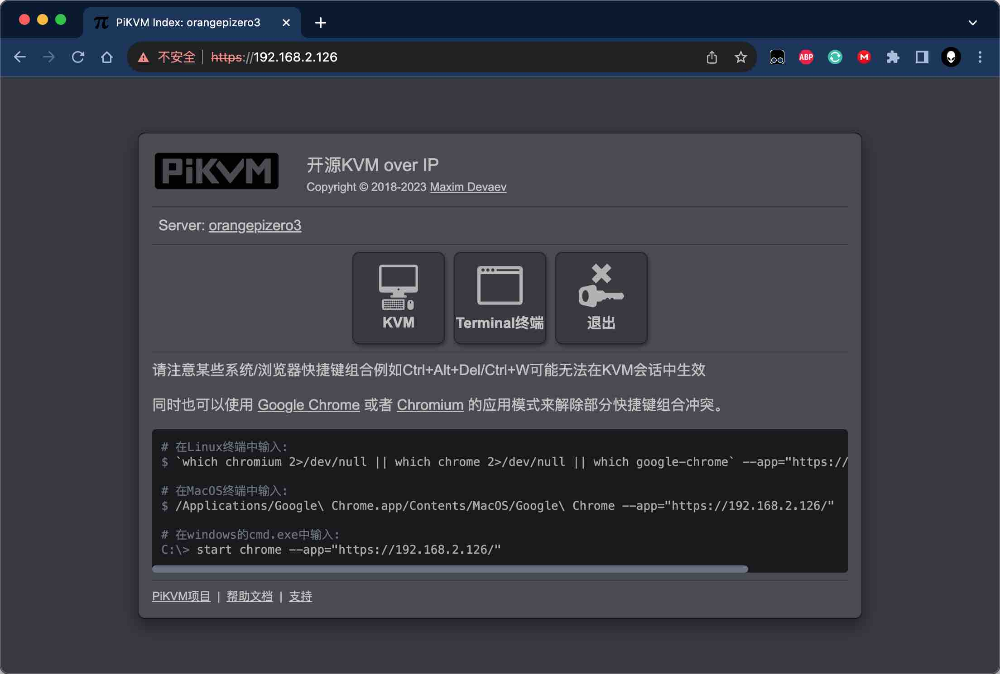
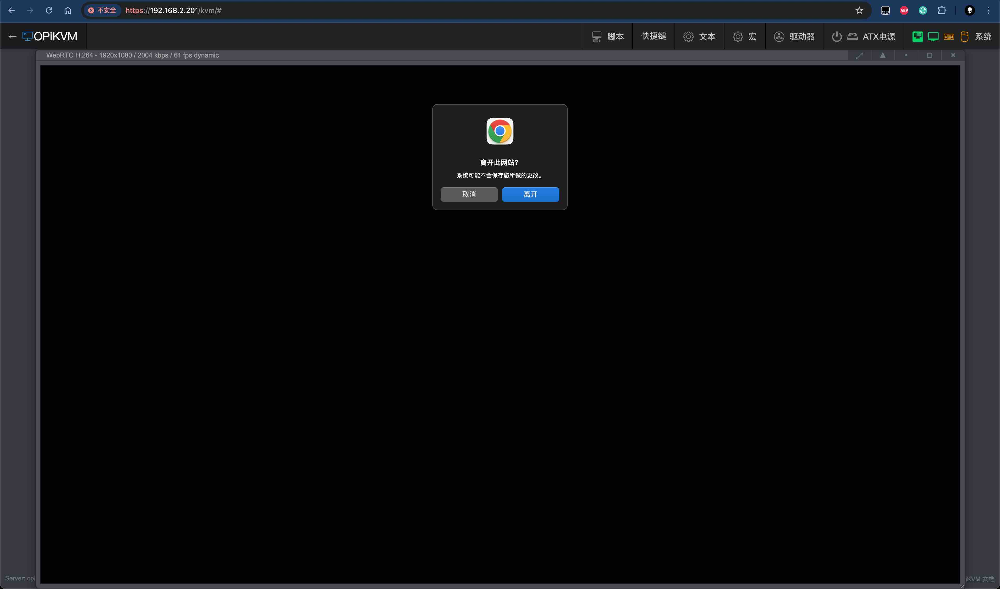
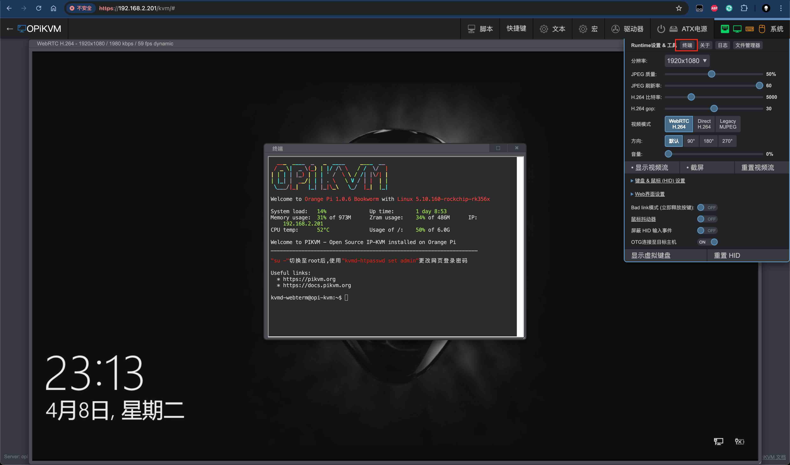

# 首次启动

!!! note "准备工作"

    * TF卡一张，建议容量16G以上Class10的内存卡

!!! warning "注意! OPiKVM CM4发货时已经预先刷好镜像,您不需要再烧录,如果需要重新刷镜像按照下列方法烧录镜像"

-----

## 接通电源

!!! warning "切记 **不要!** 插入电压输出大于5V的电源适配器，会烧坏开发板。"

    * 连接一个 5V/3A 的 USB Type-C 接口的高品质的电源适配器
    * Type-C电源接口不支持PD协商

!!! tip

    * 首次上电时系统会进行初始化，此时oled屏幕上会提示"系统正在初始化中，请勿中断"，请稍微等待至屏幕出现设备ip地址后，系统加载完成。

    * {:width="150px" .off-glb}

## 等待系统初始化完成

!!! danger "✮ ✮ ✮ 重要!修改密码! ✮ ✮ ✮"
    PiKVM默认密码:

    * **Linux admin** (SSH, console, 等.): 用户名 `root`和`orangepi`, 密码都为 `orangepi`。
    * **PiKVM Web登录页面** ([API](https://github.com/pikvm/pikvm/blob/master/docs/api.md), [VNC](https://github.com/pikvm/pikvm/blob/master/docs/vnc.md)...): 用户名 `admin`, 密码 `admin`, 默认未启用2FA code.

    **这是两个独立的实体，拥有独立的账户。**

    您需要通过SSH或Web终端更改密码。
    如果您使用的是 Web Terminal终端，请输入“su -”命令以获取“root”访问权限（输入“root”用户密码）。

    ```console
    [kvmd-webterm@orangepizero3:~$] su -
    Password:
    [root@orangepizero3:~#] passwd                   #修改root密码
    New password:
    Retype new password:
    passwd: password updated successfully
    [root@orangepizero3:~#]
    [root@orangepizero3:~#] passwd orangepi          #修改orangepi密码
    New password:
    Retype new password:
    passwd: password updated successfully
    [root@orangepizero3:~#]
    [root@orangepizero3:~#]
    [root@orangepizero3:~#]kvmd-htpasswd set admin   #修改web密码
    Password:
    Repeat:
    [root@orangepizero3:~#]
    ```

    如果需要其他用户访问Web UI，请使用以下命令:

    ```console
    [root@orangepizero3:~#] kvmd-htpasswd set <user> # 设置新用户或更改现有用户密码
    Password:
    Repeat:
    [root@orangepizero3:~#]
    [root@orangepizero3:~#] kvmd-htpasswd del <user> # 删除用户
    ```
    **或者，您也可以启用[2FA双因素身份验证](auth.md#2fatwo-factor-authentication)以提高安全性。**

    *在PiKVM首次启动时不需要更改[VNCAuth密钥](https://github.com/pikvm/pikvm/blob/master/docs/vnc.md)和[IPMI密码](https://github.com/pikvm/pikvm/blob/master/docs/ipmi.md)，因为这些服务在默认情况下是禁用的。*

## 登录方式

!!! tips

    * Web UI登录用于访问远程主机
    * SSH用于登录PiKVM本机系统

-----

### Web UI登录

- 打开浏览器输入PiKVM的ip地址，ip地址会在oled屏幕上显示,输入[`PiKVM Web`](auth.md)用户名密码，如果开启了[2FA](auth.md#2fatwo-factor-authentication)功能，也请输入2FA code

    {.off-glb}

- 登录成功后会跳转至网页控制台，分别为`KVM`、`Terminal终端`、`登出`按钮

    {.off-glb}

-----

### KVM

- 点击`KVM`按钮进入KVM功能界面，可以看到采集到远程主机的HDMI输出画面

    {.off-glb}

- 点击左上角OPiKVM图标，提示离开此网站，点击离开，返回主控制台

    {.off-glb}

-----

### Web Terminal终端

有以下两种方式打开Web终端

1. 控制台点击`Terminal`按钮，进入Web Terminal终端

    {.off-glb}

2. `KVM`界面下点击`系统` > `终端`

    {.off-glb}

    Web Terminnal会以[`kvmd-webterm`](auth.md)账户默认登录，使用浏览器后退按钮返回控制台

    !!! example "也可以使用SSH终端软件通过root账号进行登录"
        ```console
        ssh root@PiKVM地址
        ```
