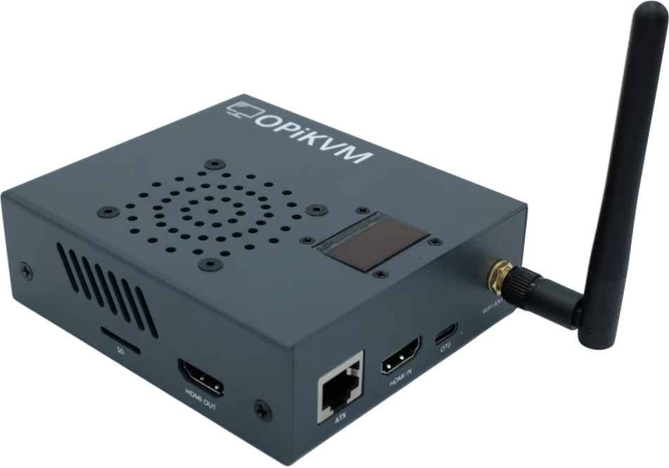
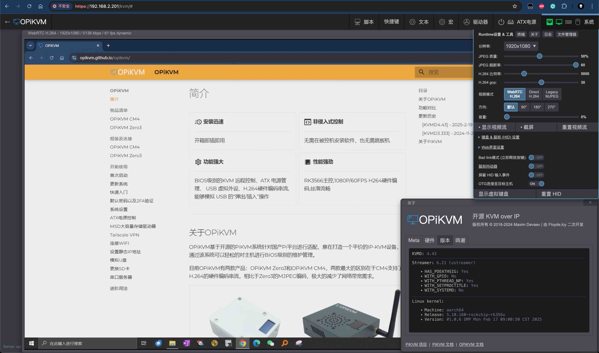

# 简介

- :material-clock-fast:{ .lg .middle } __安装迅速__

    -----

    开箱即插即用

- :material-application-brackets-outline:{ .lg .middle } __非侵入式控制__

    -----

    无需在被控机安装软件，也无需跳板机

- :material-cog-outline:{ .lg .middle } __功能强大__

    -----

    BIOS级别的KVM 远程控制、ATX 电源管理、 USB 虚拟外设、H.264硬件编码串流,能够模拟 USB 的“弹出/插入”操作

- :material-chip:{ .lg .middle } __性能强劲__

    -----

    RK3566主控,1080P/60FPS H264硬件编码,丝滑流畅

-----

## 关于 OPiKVM

OPiKVM 基于开源的 PiKVM 系统针对国产Pi平台进行适配，意在打造一个平价的 IP-KVM 设备，通过该系统可以轻松的对主机进行 BIOS 级别的维护管理。

目前 OPiKVM 有两款产品：OPiKVM Zero3 和 OPiKVM CM4，两款最大的区别在于 CM4 支持了 H.264 的硬件编码串流，相比于 Zero3 的M JPEG 编码，极大的减少了网络带宽需求。

| {:width="400px" .off-glb} | {:width="400px" .off-glb} |
| :--------: | :--------: |
| **OPiKVM Zero3** | **OPiKVM CM4** |

## 功能对比

| | **OPiKVM Zero3**      | **OPiKVM CM4**      | **原版PIKVM** |
| :---------- | :-------------------- | :------------------ | :------------- |
| **主控**       | Allwinner H618        | Rockchip RK3566     | 树莓派BCM2711 |
| **音频串流**    | **:x:不支持** | :material-check:支持 | :material-check:支持 |
| **视频直通**    | **:x:不支持** | :material-check:支持 | :material-check:支持 |
| **H.264硬件编码串流** | **:x:不支持** | :material-check:支持 | :material-check:支持 |
| **MJPEG采集**   | :material-check:支持 | :material-check:支持 | :material-check:支持 |
| **POE供电** | **:x:不支持** | :material-check:支持(可选) | 未知 |
| **模拟USB键盘/鼠标** | :material-check:支持  | :material-check:支持 | :material-check:支持 |
| **模拟外置Flash Drive/CD-ROM** | :material-check:支持 | :material-check:支持 | :material-check:支持 |
| **模拟USB"弹出/插入"** | :material-check:支持 | :material-check:支持 | :material-check:支持 |
| **内置OLED屏幕** | :material-check:支持 | :material-check:支持 | :material-check:支持 |
| **4口KVM切换器支持** | :material-check:支持(4ATX版本支持KVM切换) | :material-check:支持 | :material-check:支持 |
| **散热类型** | 被动 | 主动 | 主动 |
| **PWM调速** | **:x:不支持** | :material-check:支持 | :material-check:支持 |
| **风扇转速/健康监视** | **:x:不支持** | :material-check:支持 | :material-check:支持 |

## 更新历史

所有版本的更新记录均列于此。每个版本的更新说明包括新功能、修复的 bug 和任何重大变更。

### :material-open-source-initiative:{ .lg .middle } __[ KVMD 4.67 ] - 2025-4-28__

- 升级版本,基于 KVMD 4.67 版本发布
- 新增[麦克风](audio.md#_3)功能
- 新增 MSD 支持 CD/DVD 模式，支持挂载大于4GB ISO镜像
- 新增 ntfs3 支持，提升模拟U盘功能在 windows 操作系统下的读取/写入速度
- 新增 OPiKVM-AP 热点服务以及 [Wi-Fi 配网服务](network.md#wi-fi)

### :material-open-source-initiative:{ .lg .middle } [ KVMD 4.43 ] - 2025-2-19

- 基于 KVMD 4.43 版本发布
- 优化 H.264 硬件编码效率,支持1080p 60FPS，更加丝滑流畅
- 新增 H.264 over HTTP 模式,免受 webrtc 被防火墙的困扰

### :material-open-source-initiative:{ .lg .middle } [ KVMD 3.333 ] - 2024-11-20

- 首次发布版本,基于 KVMD 3.333 版本发布
- 实现 H.264 硬件编码

-----

## 关于 PiKVM

PiKVM 是一个基于树莓派硬件的开源 KVM over IP 系统

>*"This device helps to manage servers or workstations remotely, regardless of the health of the operating system or whether one is installed. You can fix any problem, configure the BIOS, and even reinstall the OS using the virtual CD-ROM or Flash Drive."* ---
>*[PiKVM主页](https://pikvm.org/) & [PiKVM GitHub](https://github.com/pikvm/pikvm)*
>
>*该设备有助于远程管理服务器或工作站，无论操作系统的运行状况如何或是否安装了操作系统。您可以修复任何问题，配置 BIOS，甚至使用虚拟 CD-ROM 或闪存驱动器重新安装操作系统。*
