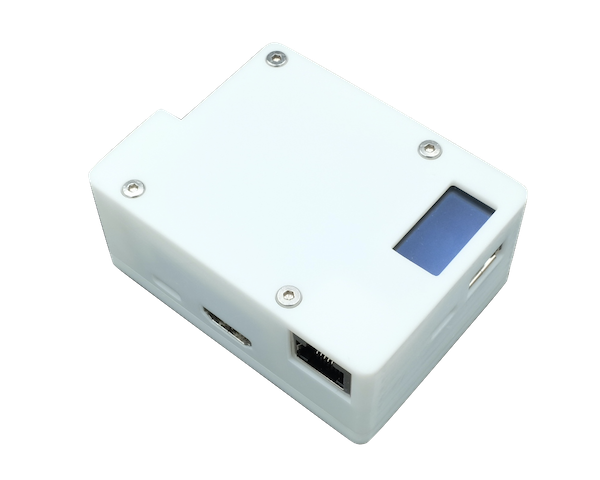

# 简介

-----
## 关于OPiKVM

OPiKVM基于开源的PiKVM系统针对国产Pi平台进行适配，意在打造一个平价的IP-KVM设备，通过该系统可以轻松的对主机进行BIOS级别的维护管理。

目前OPiKVM有两款产品：OPiKVM Zero3和OPiKVM CM4，两款最大的区别在于CM4支持了H.264的硬件编码串流，相比于Zero3的MJPEG编码，极大的减少了网络带宽需求。

| {:width="400px" .off-glb} | {:width="400px" .off-glb} |
| :--------: | :--------: |
| **OPiKVM Zero3** | **OPiKVM CM4** |

## 功能对比

| | **OPiKVM Zero3**      | **OPiKVM CM4**      | **原版PIKVM** |
| :---------- | :-------------------- | :------------------ | :------------- |
| **主控**       | Allwinner H618        | Rockchip RK3566     | 树莓派BCM2711 |
| **音频串流**    | **:x:不支持** | :material-check:支持 | :material-check:支持 |
| **视频直通**    | **:x:不支持** | :material-check:支持 | :material-check:支持 |
| **H.264硬件编码串流** | **:x:不支持** | :material-check:支持 | :material-check:支持 |
| **MJPEG采集**   | :material-check:支持 | :material-check:支持 | :material-check:支持 |
| **POE供电** | **:x:不支持** | :material-check:支持(可选) | 未知 |
| **模拟USB键盘/鼠标** | :material-check:支持  | :material-check:支持 | :material-check:支持 |
| **模拟外置Flash Drive/CD-ROM** | :material-check:支持 | :material-check:支持 | :material-check:支持 |
| **模拟USB"弹出/插入"** | :material-check:支持 | :material-check:支持 | :material-check:支持 |
| **内置OLED屏幕** | :material-check:支持 | :material-check:支持 | :material-check:支持 |
| **4口KVM切换器支持** | :material-check:支持(4ATX版本支持KVM切换) | :material-check:支持 | :material-check:支持 |
| **散热类型** | 被动 | 主动 | 主动 |
| **PWM调速** | **:x:不支持** | :material-check:支持 | :material-check:支持 |
| **风扇转速/健康监视** | **:x:不支持** | :material-check:支持 | :material-check:支持 |

## 关于PiKVM

PiKVM是一个基于树莓派硬件的开源KVM over IP系统

>*"This device helps to manage servers or workstations remotely, regardless of the health of the operating system or whether one is installed. You can fix any problem, configure the BIOS, and even reinstall the OS using the virtual CD-ROM or Flash Drive."* ---
>*[PiKVM主页](https://pikvm.org/) & [PiKVM GitHub](https://github.com/pikvm/pikvm)*
>
>*该设备有助于远程管理服务器或工作站，无论操作系统的运行状况如何或是否安装了操作系统。您可以修复任何问题，配置 BIOS，甚至使用虚拟 CD-ROM 或闪存驱动器重新安装操作系统。*
