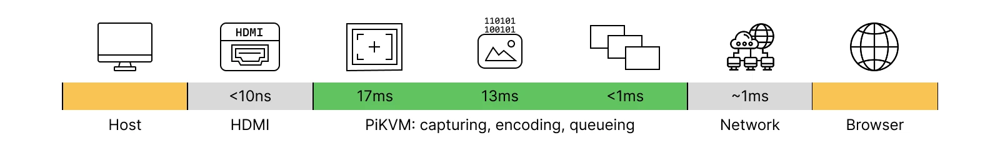
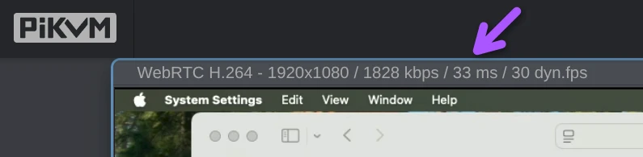

当你通过 KVM-over-IP 设备控制远程计算机时，总是会存在一定的延迟 —— 即你的操作与屏幕显示之间的间隔。当延迟相对较低时，使用 KVM-over-IP 感觉非常自然，但高延迟则会令人感到沮丧。

目前，**PiKVM 提供了 35-50 毫秒的总延迟** —— 这被证明是目前市面上所有 KVM-over-IP 设备中最低的端到端延迟。

我们付出了巨大努力来消除尽可能多的瓶颈，以提供当今市场上最低的延迟。本文将详细拆解 PiKVM 视频管道中延迟的来源、你可以合理期待的延迟范围，以及如何亲自进行测量。

## 什么是 KVM 延迟？

当你在 PiKVM 中移动鼠标时，可以看到远程光标落后于本地光标（由一个蓝色圆点指示）。这就是 *延迟* —— 即键盘/鼠标输入与远程主机响应画面之间的延迟。

延迟决定了 KVM-over-IP 设备对用户的“响应感”：

- 低于 30 毫秒：感觉几乎是瞬时的，但在远程会话中很难实现。
- 30-50 毫秒：次优选择，能够胜任绝大多数任务。
- 50-100 毫秒：通常可用，但在快速移动时能察觉到轻微的延迟。
- 100 毫秒以上：通常会被察觉到迟钝。

!!! tip "我们的延迟测试结果"

    在下列条件下，PiKVM 从捕获到显示的**总延迟约为 35-50 毫秒**：

    * 分辨率：1920x1080 @ 60Hz
    * WebRTC H.264 视频模式（默认）
    * H.264 kbps = 5000（默认）
    * H.264 gop = 0（默认）
    * 通过局域网或优质互联网连接进行访问

接下来，我们将解释这些数据是如何得出的，以及你如何自行复现这些测试以验证我们的结果。

-----

## 视频管道

PiKVM 需要与物理世界交互：它通过线缆采集视频，进行编码，然后通过网络发送到你的浏览器。



```
+--= 主机 =--+           +-------= PiKVM =-------+           +---= 浏览器 =---+
|            |   HDMI    |                       |           |                 |
|     源     |==========>|-->[视频采集] (17ms)   |           |   [画面渲染]    |
| 1920x1080  |   线缆    |        |              |           |        ^        |
|    60Hz    |           |        V              |           |        |        |
|            |           |   [视频编码]  (13ms)  |           |   [视频缓冲]    |
+------------+           |        |              |           |        ^        |
                         |        V      (~0ms)  |   网络    |        |        |
                         |   [队列等待]---------->|==========>|-->[流组装]      |
                         |                       |           |                 |
                         +-----------------------+           +-----------------+
```

让我们逐个阶段来看。

### 1. 主机

主机在显存中生成图像，以便发送到物理显示器。这个时间微乎其微。接着，主机将该图像转换为视频信号，通常会发送给显示器。PiKVM 会模拟成一个真实的显示器，并向主机提供一组其支持的显示分辨率和刷新率（以 Hz 测量的频率）。主机选择最合适的模式，将信号输出到 HDMI 线缆上。

### 2. HDMI 线缆

HDMI 线缆以操作系统设定的频率传输数据。因为它不是 PiKVM 信号路径的一部分，所以我们不将其计算在内。即使计算进去，一条 1 米长的线缆也只增加大约 5-10 纳秒的延迟。这也是一个可以忽略不计的延迟量。

### 3. PiKVM

在 PiKVM 内部，延迟累积在三个阶段：采集、编码和队列等待。由于使用了 DMA（直接内存访问）或传输的已压缩视频数据量很小，这些阶段之间的数据传递几乎不需要时间。

### 3.1 视频采集

这是我们开始测量延迟的地方。

60Hz 的显示刷新率意味着每秒有 60 帧信号通过 HDMI 线缆发送。因此，一帧画面从开始到结束需要 `1秒 / 60 = 0.017秒` 即 17 毫秒。对于 24 位 RGB 1920x1080 像素的视频，这意味着 HDMI 线缆每 17 毫秒需要传输大约 6MB 的视频数据。

PiKVM 的视频采集频率始终与主机的刷新率保持一致。但是，在完整接收整帧画面之前，是无法开始处理该帧的。因此：

- PiKVM V4：`1秒 / 60 = 17 毫秒`
- PiKVM V3/DIY：`1秒 / 50 = 20 毫秒`

换句话说，刷新率越高，单帧传输时间就越短，延迟也就越低。

所以，这是延迟的第一个来源：**1080p 60Hz 视频的采集时间为 17 毫秒**。

### 3.2. 视频编码

PiKVM 将采集到的帧发送给硬件 H.264 编码器。这里没有特别复杂的逻辑。编码可以在开启或不开启 Boost（加速）的情况下进行：

- 开启 Boost：在 1080p 下每秒编码 60 帧需要 13 毫秒。
- 未开启 Boost：在 1080p 下每秒编码 30 帧需要 20 毫秒，每隔一帧会被跳过。

因此，在开启 Boost 的情况下，我们在总延迟中又加上了 **13 毫秒的编码时间**。到这个阶段，总延迟累计为 30 毫秒。

### 3.3. 队列等待

编码后的视频帧被传输到 WebRTC 服务器，拆分为 RTP 视频数据包，并附带元数据以及有关浏览器设置的建议，然后尽快通过网络发送出去。

该阶段自身的延迟**小于 1 毫秒**，因此到目前为止总延迟仍在大约 30 毫秒左右。

### 4. 网络

这里的一般规律是，帧大小越小，在网络上的传输速度就越快。PiKVM 中每个常规视频帧的大小只有几千字节，因此它完全取决于你的网络连接质量、地理位置以及你与 PiKVM 之间的距离。我们无法控制这些因素。

我们默认使用的编码参数对于常规互联网连接来说是最优的。如果你降低比特率，可以节省一些带宽并降低延迟。

本地局域网增加的延迟**小于 1 毫秒**。我们此时依然停留在 30 毫秒的延迟范围内。

### 5. 浏览器

浏览器组装 WebRTC RTP 流，进行缓冲，然后渲染图像。所有现代浏览器都使用 Google 的 WebRTC 架构，其运行速度几乎同样快。不同之处在于浏览器使用的是哪种 H.264 解码器（硬件还是软件）、实现了哪些 RTP 扩展等等。

根据我们的经验，Chrome 或 Chromium 的表现最好，其次是 Safari 和 Firefox。Brave 和其他浏览器并不总是能很好地处理实时流媒体，尽管它们也使用了 Blink 或 WebKit 引擎。

为了实现最小的延迟，PiKVM 在此处使用了一些特殊的 RTP 设置，将缓冲时间缩短到几乎为零。然而，浏览器内部处理和渲染仍会增加一些延迟。

此外，从显卡到显示器的物理画面渲染时间，与从主机到 PiKVM 的 HDMI 线缆传输原理完全相同（即使你使用的是笔记本电脑来访问）。你显示器的刷新率越高，延迟就越低。

我们可以假设，由于解码和其他处理，这里会**增加平均 10-20 毫秒**的延迟，具体取决于客户端的显示器刷新率。

-----

## 测量延迟

### 内部耗时

上文中，我们提到了 PiKVM 内部流程中发生的许多耗时。

为了确保这些耗时是准确的，你可以使用 PiKVM 的专用分析工具，它将测量从视频采集芯片接收到第一个字节开始，到图像发送给客户端为止的各个耗时。

在 PiKVM 上运行以下命令（同时在浏览器中打开视频流）：

```console
[root@pikvm ~]# ustreamer-dump -s kvmd::ustreamer::h264 --verbose
...
... 1920x1080 ... GRAB=0.017 ~~0.000~~ ENC=0.014 ~~> LAT=0.031 - size=5878
... 1920x1080 ... GRAB=0.017 ~~0.000~~ ENC=0.013 ~~> LAT=0.030 - size=7139
... 1920x1080 ... GRAB=0.017 ~~0.000~~ ENC=0.014 ~~> LAT=0.031 - size=14058
...
```

* `GRAB=` - 视频采集时间。
* `~~xxx~~` - 阶段之间的间隔时间。
* `ENC=` - 视频编码时间。
* `LAT=` - 视频采集完成到向客户端发送 H.264 之前的最终延迟。

### 到浏览器的端到端耗时

使用此方法进行的测量覆盖了除显示器物理渲染之外的整个视频处理链（从 PiKVM 采集开始，到浏览器结束）。起点是 HDMI 帧的第一个字节进入 PiKVM 视频采集芯片的时刻。该时间戳会被保存，然后通过 WebRTC 并利用 RTP 扩展 [abs-capture-time](http://www.webrtc.org/experiments/rtp-hdrext/abs-capture-time) 传输至浏览器。浏览器每秒从最新接收到的帧中提取该时间，并在 Web 界面上输出当前时间与该时间戳之间的差值。

使用此方法时，运行浏览器的客户端电脑与 PiKVM 上的时钟必须通过 NTP 进行精确同步。此外，我们建议在局域网内进行测量，因为在互联网上测量时，即使有 NTP，也可能由于链路抖动导致时钟同步出现偏差。

该测量方法仅在 Chromium 或 Chrome 中可用，因为它们支持所需的 [abs-capture-time](http://www.webrtc.org/experiments/rtp-hdrext/abs-capture-time) 扩展。

如果你使用的是 Linux，可以安装 [chrony](https://chrony-project.org/) 以实现极高精度的 NTP 同步。在我们的测试中，我们使用的是 ubuntu Linux 上的 Chrome，准备工作如下：

```console
[root@localhost ~]# apt update
[root@localhost ~]# apt install chrony
[root@localhost ~]# systemctl stop systemd-timesyncd
[root@localhost ~]# systemctl start chronyd
```

在 PiKVM 上执行类似的操作：

* 首先更新你的设备系统, 如果需要的话：

* 安装并运行 `chrony`：

    ```console
    [root@pikvm ~]# apt update
    [root@pikvm ~]# apt install chrony
    [root@pikvm ~]# systemctl stop systemd-timesyncd
    [root@pikvm ~]# systemctl start chronyd
    ```

理想情况下，客户端和 PiKVM 应当使用相同的 NTP 服务器。你可以编辑 `/etc/chrony.conf` 进行配置。

要进行测量，请访问 PiKVM 的 Web 界面，并在 URL 中添加 `show_webrtc_latency=1` 参数，例如：`https://pikvm/kvmd/?show_webrtc_latency=1`。如果需要，可在系统菜单中将视频模式切换为 WebRTC。连接建立并稳定后，你将在视频流窗口中看到计算出的延迟：



如前所述，测得的数值不包括在浏览器物理显示器上的渲染和显示时间。对于 60Hz 屏幕，需要另加 +17 毫秒；对于 144Hz 屏幕，需要另加 +6 毫秒。在两种情况下，你得到的总延迟都**在大约 50 毫秒或更低**。
