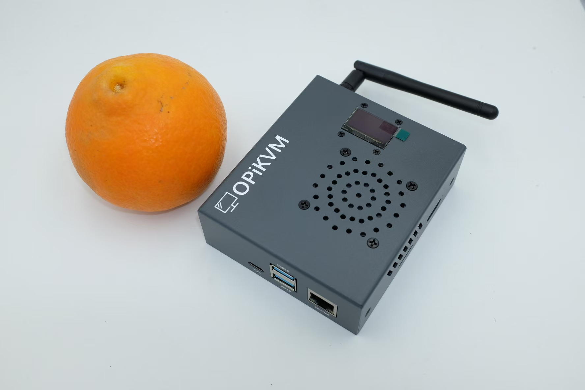
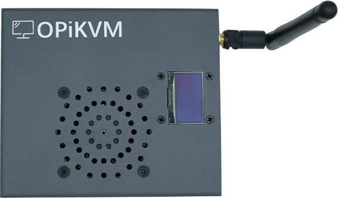
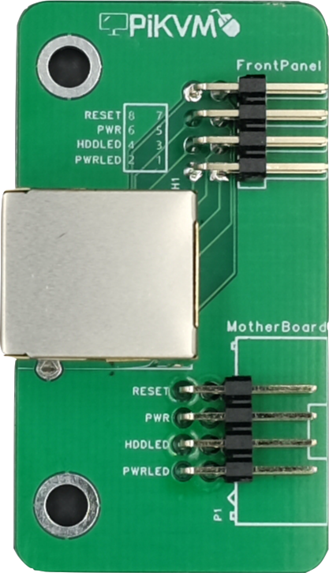

# OPiKVM CM4

{:width="800px" .off-glb}

---

## OPiKVM CM4包含哪些配件

| **OPiKVM CM4** | |
| :--- | :--- |
| 主机 x 1 | {:width="400px" .off-glb} |
| ATX控制小板 x 1 | {:width="60px" .off-glb} |
| 5V3A电源 x 1 | |
| Type-C电源线 x 1 | |
| Type-A口转Typc-C口USB-OTG线 x 1 | |
| HDMI连接线 x 1 | |
| 32G容量TF卡 x 1 | |

### 可选配件

- POE供电模块 x 1  *可选*
