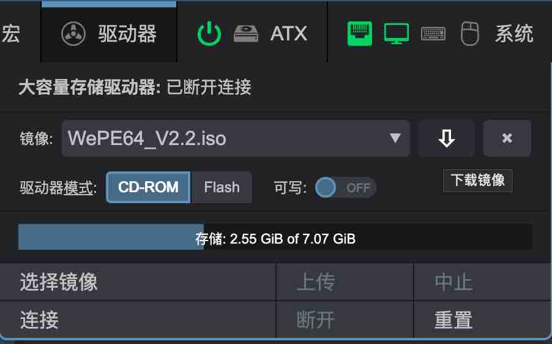

# MSD大容量存储驱动器

MSD(Mass Storage Drive)大容量存储驱动器，它允许 OPiKVM 为目标主机模拟虚拟 CD/DVD 或闪存驱动器，
即使在需要 Live CD 恢复操作系统或重装系统的 BIOS/UEFI 环境下也可使用。

| 查看 Web UI 中的 `驱动器` 菜单 |
|-----------------------------------------------|
| {:width="400px" .off-glb} |

此处提供以下操作：

* 将镜像上传至 OPiKVM MSD分区
* 选择要连接至目标主机的镜像
* 更改媒体类型和写入模式
* 从 OPiKVM 存储下载镜像
* 驱动器连接管理等

!!! warning
    **在镜像上传期间**或**镜像以写入模式连接至目标主机时**，切勿关闭 PiKVM 电源。
    否则可能导致文件损坏。

!!! info "只有在重新连接设备时，才能在CD-ROM和Flash之间更改介质类型"
    可以使用Web UI中的`系统 -> OTG连接到目标主机`开关来完成重新连接设备的操作。

    **驱动模式是在`连接`镜像时确定的，而不是通过切换`驱动器模式`**时确定的。

    简单来说，通过`驱动器模式`修改过模式后，需要点击`连接`使其更改生效，但是远程主机不会实时变化，你需要通过关开[将OTG连接到目标主机](system.md/#otg)模拟USB拔插的操作来使远程主机端识别到驱动器类型的变化。

-----

## 上传镜像

OPiKVM 将镜像存储在挂载于 `/var/lib/kvmd/msd` 的专用存储卡分区中。

大多数情况下该分区为只读状态，在启用驱动器仿真模式或上传新镜像时会自动重新挂载为可写模式。
此机制可防止突发断电导致的数据损坏。

* 点击`选择镜像 -> 选择文件`，选择镜像。

    {:width="400px" .off-glb}

* 点击上传,出现上传进度条，点击中止可以中断上传任务。

    {:width="400px" .off-glb}

??? example "如果你有手动上传镜像的需求,分步操作：使用 SCP 或 rsync 手动上传镜像"

    1. 手动将内部存储重挂载为读写模式：
        ```console
        [root@opi-kvm ~]# kvmd-helper-otgmsd-remount rw
        ```

    2. 使用 `scp` 等工具将镜像上传至 `/var/lib/kvmd/msd`

    3. 将内部存储重挂载回安全的只读模式：
        ```console
        [root@opi-kvm ~]# kvmd-helper-otgmsd-remount ro
        ```

-----

## 连接镜像

* `镜像`下拉框中选择镜像，点击`连接`，通过`ATX`打开远程主机电源，进入bios启动项页面，选择**PiKVM CD-ROM Driver**，回车开始引导

    {.off-glb}

* 远程主机开始引导镜像

    {.off-glb}

-----

## 管理镜像

* 点击`断开`，大容量存储驱动器状态成为已断开连接状态下，`镜像`下拉选中需要操作的镜像，点击下拉框右侧的下载、删除按钮对镜像进行相应操作。

    {:width="400px" .off-glb}

-----

## 可写闪存驱动器

当 OPiKVM 模拟闪存驱动器时，可允许目标主机向镜像写入文件。
停止驱动器后，可下载此镜像并在本地主机打开。
适用于需要从目标主机获取文件的场景，具体方案请参考[文件传输](simUSB.md)。

-----

## NFS 存储

使用 [NFS](https://en.wikipedia.org/wiki/Network_File_System) 可为整个 OPiKVM 集群创建共享镜像存储。

若有现成共享，可通过创建挂载点并添加相关记录到 `/etc/fstab` 轻松连接至 PiKVM。
此时您既能通过 PiKVM Web UI 上传镜像至 NFS，也能继续使用本地存储。

??? example "分步操作：连接 NFS 存储"

    1. 执行准备工作：

        [root@opi-kvm ~]# kvmd-helper-otgmsd-remount rw
        [root@opi-kvm ~]# mkdir -p /var/lib/kvmd/msd/NFS_Primary
        [root@opi-kvm ~]# mkdir -p /var/lib/kvmd/msd/NFS_Secondary
        [root@opi-kvm ~]# kvmd-helper-otgmsd-remount ro
        ```

    2. 将 NFS 共享添加到 `/etc/fstab`：
        ```fstab
        server:/srv/nfs/NFS_Primary    /var/lib/kvmd/msd/NFS_Primary    nfs vers=3,timeo=1,retrans=1,soft,nolock  0 0
        server:/srv/nfs/NFS_Secondary  /var/lib/kvmd/msd/NFS_Secondary  nfs vers=3,timeo=1,retrans=1,soft,nolock  0 0
        ```

    3. 执行 `reboot` 应用所有更改

确保 `kvmd` 用户对这些目录拥有*读取*权限（如需写入也可授权）。
为获得最佳性能，需确保与 NFS 服务器的可靠连接并使用最小 `timeo` 和 `retrans` 值。
**必须使用 `soft` 选项，建议使用 `nolock`**。

注意：若从外部向 NFS 存储添加镜像，OPiKVM 无法跟踪此事件，
需使用 Web UI 的 `驱动器 -> 重置` 刷新镜像列表。

NFS 服务器配置不在本文档讨论范围内。

-----

## Samba/CIFS 存储

若已有本地 Samba 服务器（如 Unraid 或其他 NAS），可直接使用其中的 ISO 文件。
需要重启才能刷新共享中的可用 ISO 列表。

??? example "分步操作：连接 Samba/CIFS 存储"

    1. 执行准备工作：
        ```console
        [root@opi-kvm ~]# kvmd-helper-otgmsd-remount rw
        [root@opi-kvm ~]# mkdir -p /var/lib/kvmd/msd/isos
        [root@opi-kvm ~]# kvmd-helper-otgmsd-remount ro
        ```

    2. 将 Samba/CIFS 共享添加到 `/etc/fstab`：
        ```fstab
        //192.168.0.1/isos   /var/lib/kvmd/msd/isos   cifs  guest,_netdev,nofail 0 0
        ```

    3. 执行 `reboot` 应用所有更改

-----

## 多驱动器配置

默认 OPiKVM 为大容量存储仿真创建一个虚拟驱动器。
但必要时可通过终端控制台创建附加驱动器进行管理。
此功能适用于需要从第一个驱动器启动目标主机，
然后连接第二个驱动器传输文件的场景。

!!! note
    第一个虚拟驱动器可通过 Web UI（`驱动器`菜单）和终端命令行工具管理。
    附加驱动器仅能通过控制台控制。

附加驱动器可能会涉及兼容性的问题：
假设同一USB上有多个驱动器，可能在极少数BIOS/UEFI下导致无法识别到对应的驱动器。
因此出于稳定性考虑，此功能需手动激活。
建议提前设置驱动器，确保特定目标主机仍能从 ISO CD 或 Flash 启动，
再按计划使用驱动器。

附加驱动器会消耗更多端点资源，详见：

{!_usb_limits.md!}

要添加第二个虚拟驱动器，请按照以下步骤操作：

??? example "添加附加驱动器用于虚拟U盘"

    1. 切换至root权限，编辑 `/etc/kvmd/override.yaml` :

        ```yaml
        otg:
            devices:
                drives:
                    enabled: true  # Set it to true to enable
                    count: 1  # +1 drive, default value
                    default:  # Default configuration for the all extra drives
                        cdrom: false  # Default value (false for the generic flash drive)
                        rw: false # Read-only by default
        ```

        或者直接使用指令添加配置文件

        ```sh
        cat << EOF > /etc/kvmd/override.d/extraUSB.yaml
        otg:
            devices:
                drives:
                    enabled: true  # Set it to true to enable
                    count: 1  # +1 drive, default value
                    default:  # Default configuration for the all extra drives
                        cdrom: false  # Default value (false for the generic flash drive)
                        rw: false # Read-only by default
        EOF
        ```

    2. 重启PiKVM:

        ```console
        [root@opi-kvm:~#] reboot
        ```

-----

## 手动驱动器管理

`kvmd-otgmsd` 命令行工具用于管理附加驱动器（及第一个主驱动器）。
运行 `kvmd-otgmsd --help` 查看完整选项列表。

??? example "分步操作：创建附加闪存驱动器镜像以从目标主机获取文件"

    1. 创建指定大小的空镜像文件（本例 1GB, -s 指定镜像大小, -t 指定文件系统类型）：
        ```console
        [root@pikvm ~]# make-flash.sh -p /root/flash.img -s 1 -t vfat
        ```

    2. 将其连接到驱动器 `1`（创建过程见前文）：
        ```console
        [root@pikvm ~]# kvmd-otgmsd -i 1 --set-rw=1 --set-cdrom=0 --set-image=/root/flash.img
        ```
        !!! note
            * 索引 `0` 代表通过 Web UI 和 API 控制的主驱动器
            * `--set-cdrom=1` 时：小镜像作为 CD-ROM，大镜像作为 DVD-ROM
              注意 CD/DVD 不可写（此时应使用 `--set-rw=0`）

    3. 此步骤后，可从目标主机访问闪存驱动器并按常规方式格式化

    4. 查看驱动器状态：
        ```console
        [root@pikvm ~]# kvmd-otgmsd -i 1
        Image file:  /root/flash.img
        CD/DVD flag: no
        RW flag:     yes
        ```

    5. 要禁用闪存驱动器并在 PiKVM 上查看文件：
        ```console
        [root@pikvm ~]# kvmd-otgmsd -i 1 --unlock --eject
        ```

    6. 可通过 SCP 下载最终镜像，或在 OPiKVM 上挂载至 `文件管理器` 中：
        ```console
        [root@pikvm ~]# mount -o loop /root/flash.img /mnt
        [root@pikvm ~]# ls /mnt
        [root@pikvm ~]# umount /mnt
        ```

-----

## 禁用大容量存储 { #disabling-mass-storage }

极少数情况下，若 BIOS/UEFI 无法正确识别 Mass Storage
甚至拒绝使用 USB 键鼠，可能需要禁用此功能。

??? example "分步操作：永久禁用大容量存储"

    1. 编辑 `/etc/kvmd/override.yaml` 添加配置：
        ```yaml
        kvmd:
            msd:
                type: disabled
        ```

    2. 执行重启：
        ```console
        [root@opi-kvm ~]# reboot
        ```
-----

## 使用Ventoy引导镜像

* 创建[Ventoy](https://www.ventoy.net/cn/index.html)引导镜像，镜像大小根据您所需要的安装镜像大小决定，这里以win10安装镜像为例子创建一个容量为5G的空白Ventoy引导。

    ```sh
    su -
    kvmd-helper-otgmsd-remount rw
    dd if=/dev/zero of=/var/lib/kvmd/msd/ventoy.img bs=1M count=5000 status=progress
    ```

* 下载Ventoy工具，对引导镜像进行分区并格式化。

    ```sh
    cd ~
    wget https://github.com/ventoy/Ventoy/releases/download/v1.0.96/ventoy-1.0.96-linux.tar.gz
    tar zxvf ventoy-1.0.96-linux.tar.gz
    kvmd-helper-otgmsd-remount rw
    losetup -f /var/lib/kvmd/msd/ventoy.img
    sh ~/ventoy-1.0.96/Ventoy2Disk.sh -i "$(losetup -l | grep ventoy | awk '{print $1}')"
    y
    y
    mkdir -p /mnt/ventoy
    mount "$(losetup -l | grep ventoy | awk '{print $1}')p1" /mnt/ventoy
    ```

* 将需要的安装包镜像文件拷贝至Ventoy引导镜像目录中，此时Ventoy的镜像目录挂载至/mnt/ventoy。

    !!! warning
        拷贝镜像前，请使用`df -h`指令确认/mnt/ventoy目录已经挂载

        ```console
        root@orangepizero3:~# df -h
        Filesystem      Size  Used Avail Use% Mounted on
        tmpfs            99M  7.1M   92M   8% /run
        /dev/mmcblk0p1  4.3G  2.4G  2.0G  55% /
        tmpfs           491M  148K  491M   1% /dev/shm
        tmpfs           5.0M  4.0K  5.0M   1% /run/lock
        tmpfs           491M     0  491M   0% /tmp
        /dev/mmcblk0p2   10G  6.9G  2.7G  73% /var/lib/kvmd/msd
        /dev/zram1       47M  548K   43M   2% /var/log
        tmpfs            99M     0   99M   0% /run/user/0
        /dev/loop0p1    4.9G   96K  4.9G   1% /mnt/ventoy
        ```

    ```sh
    scp windows.iso /mnt/ventoy
    ```

    或者使用FileBrowser工具，将iso上传至/mnt/ventoy

    {:width="400px" .off-glb}
    {.off-glb}

    !!! 提示
        FileBrowser的默认根目录为/mnt

    !!! 提示
        增加/更换ventoy内的安装镜像，不需要重建ventoy镜像，只需要增加/替换ventoy内的安装镜像，方法如下：

        * 将ventoy.img挂载至/mnt/ventoy目录下
            ```sh
            su -
            kvmd-helper-otgmsd-remount rw
            mount -o loop,offset=1048576 /var/lib/kvmd/msd/ventoy.img /mnt/ventoy
            df -h
            ```
        * 使用scp或者FileBrower将需要的安装包镜像文件更新至/mnt/ventoy，提前`df -h`确认/mnt/ventoy已挂载
            ```sh
            df -h
            scp windows.iso /mnt/ventoy
            ```
        * 镜像传输完成后，取消ventoy.img挂载，完成更新镜像
            ```sh
            umount /mnt/ventoy
            ```

* 待上传完成后取消挂载，并删除losetup设备

    ```sh
    umount "$(losetup -l | grep ventoy | awk '{print $1}')p1"
    losetup -d "$(losetup -l | grep ventoy | awk '{print $1}')"
    ```

* 在`驱动器`使用Flash模式挂载`ventoy.img`镜像，bios选择从PiKVM启动引导进入ventoy，按`L`键选择语言，选中镜像后回车选择正常启动，则可以开始windows安装程序，等待3-5分钟，安装程序开始。

    {.off-glb}
    {.off-glb}
    {.off-glb}
