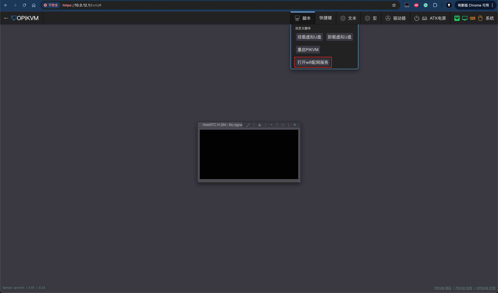
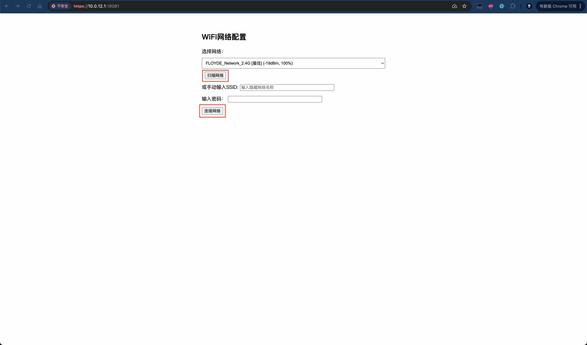
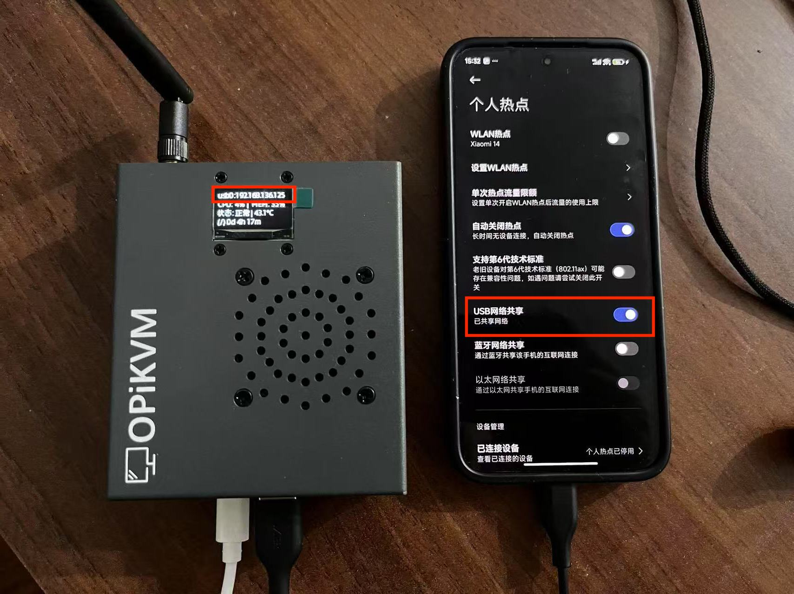
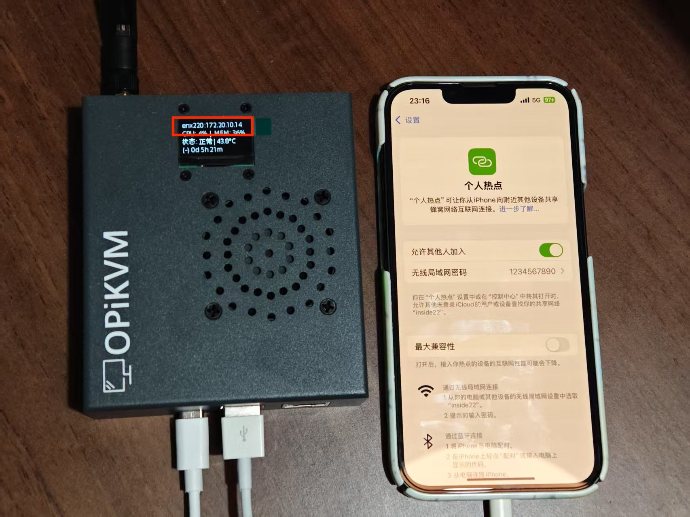

# OPiKVM 接入网络的三种方式

OPiKVM 可以通过以下三种方式快速接入到您的网络中。

* 有线网络
* Wi-Fi 无线网络
* USB 网络共享

---

## 有线网络

OPiKVM 支持 10M/100M/1000M 速率的 RJ45 网口，使您能快速接入到您的网络，
您只需将网线插入到 OPiKVM 的 RJ45 网口中，就可以将它接入到您的网络中，使用有线网络是最快捷并且稳定的方式。

---

## Wi-Fi 无线网络

OPiKVM 提供了 Wi-Fi 配网功能，使您可以将 OPiKVM 快速的接入到您的 Wi-Fi 网络中。

* 打开电脑/手机的 Wi-Fi 开关在无线列表中找到名为`OPiKVM-AP`的无线网络，使用密码`orangepi`连接该热点，
此时您可以使用浏览器访问[`https://10.0.12.1`](https://10.0.12.1)打开 OPiKVM 的 webui 并登录

!!! tip "快速提示"

    在 OPiKVM 首次启动时，会自动开启该热点方便用户接入启动配网程序，你可以在终端中使用下列指令对其进行开启/关闭

    ```sh
    su -
    systemctl start opikvm-hotspot
    systemctl stop opikvm-hotspot
    ```

* 进入 KVM 在`脚本`选项卡中点击`打开WIFI配网服务`按钮启动配网程序

{:width="800px" .off-glb}

* 浏览器访问[`https://10.0.12.1:18081`](https://10.0.12.1:18081)进入 Wi-Fi 配网页面，点击`扫描网络`按钮扫描附近的 Wi-Fi 列表，
扫描完成后下拉菜单选择您需要接入的无线网络名称并输入密码，点击`连接网络`按钮，配网成功后热点会自动关闭，此时 Wi-Fi 网络接入成功。

{:width="800px" .off-glb}

!!! tip "快速提示"

    Wi-Fi 配网成功后，OPiKVM-AP 热点会自动关闭，此时可以使用浏览器访问 oled 屏幕上的ip地址进入 OPiKVM 的管理页面，否则 OPiKVM-AP 热点会重新开启，请刷新页面重新尝试配网

---

## USB 网络共享

OPiKVM 同样支持手机的 USB 热点共享网络连接

---

### Android 手机USB网络共享

* 使用一根 USB-A 转 USB Type-C 的数据线将手机与 OPiKVM 连接起来，C口插在手机侧，A口插在 OPiKVM 的 USB 口。

* 在手机的`个人热点`的选项中，打开`USB网络共享`开关，即可完成USB网络共享，此时您可以用过手机浏览器访问 oled 上的 USB0 IP 地址访问 OPiKVM 的管理界面。

!!! warning

    由于 Android 机制的原因，手机共享的 Wi-Fi 热点与 USB 网络共享的 DHCP 地址池并不在同一个网段，所以当 OPiKVM 使用 USB 网络共享/电脑连接手机 Wi-Fi 热点时，双方无法互通，
    只能通过手机的浏览器访问 OPiKVM 的管理页面打开 Wi-Fi 配网程序进行 Wi-Fi 配网后才能与电脑互通。

{:width="800px" .off-glb}

---

### iPhone USB 网络共享

* 同样需要使用数据线将 OPiKVM 与 iPhone 连接起来，这里使用的线材根据您手机接口的不同会有些许变化，比如 Lightning 转 USB-A 等，
这里我们以 Lightning 转 USB-A 接口为例子

* 连接完成后，此时会弹出是否信任设备，选择信任，打开 iPhone 的`个人热点`,打开`允许其他人加入`，OPiKVM 就会获取到 IP 地址。

!!! tip "快速提示"

    iPhone 的 Wi-Fi 热点和 USB 网络共享使用的是同一 DHCP 地址池，所以您不仅可以使用手机浏览器访问 OPiKVM 管理页面，
    也可以通过电脑连接 iPhone 共享的 Wi-Fi 热点来访问 OPiKVM 的管理页面

{:width="800px" .off-glb}
