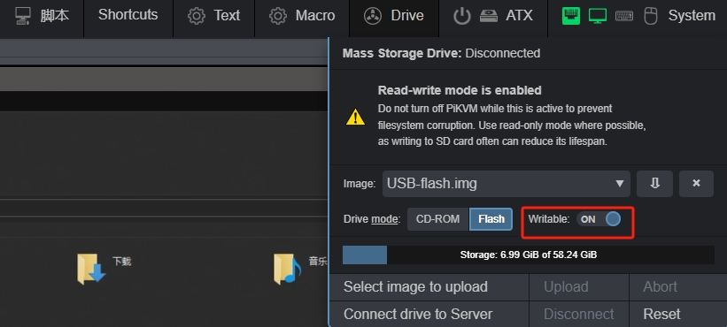
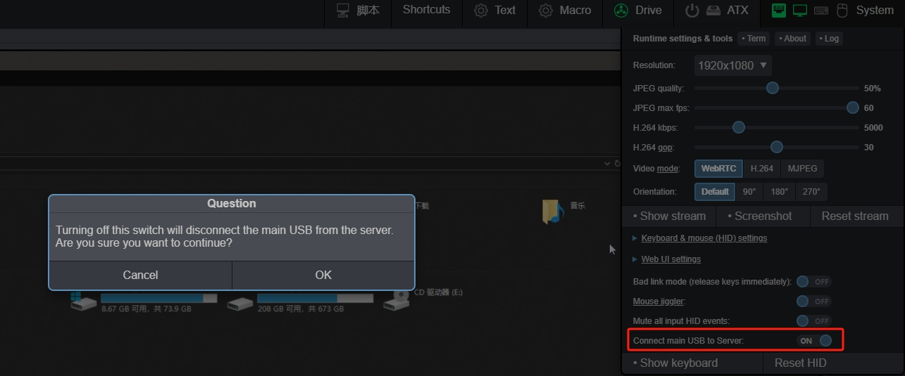
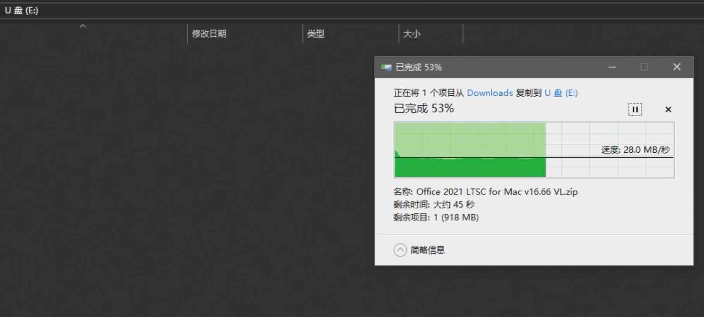
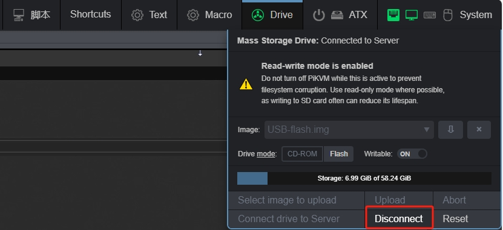
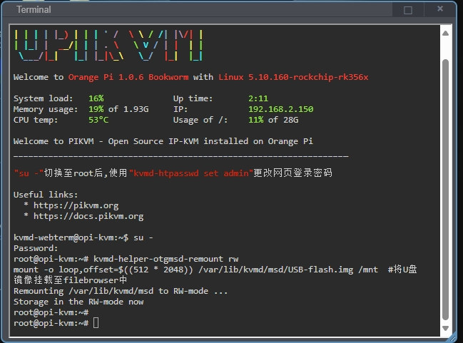
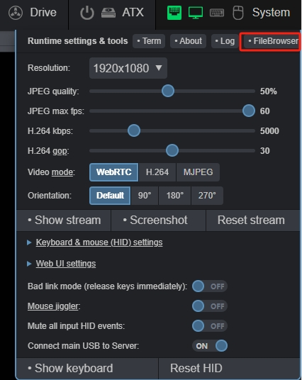
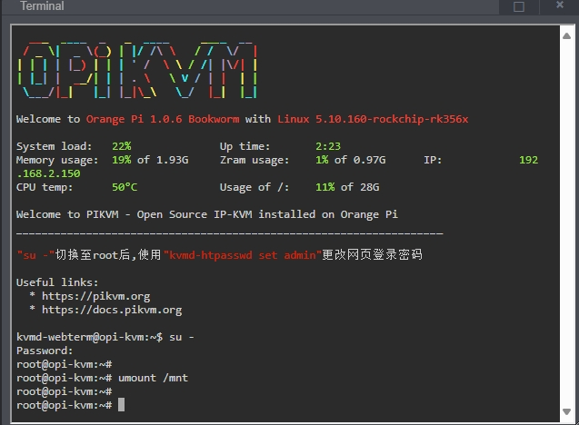

# 模拟U盘/文件传输

模拟U盘功能针对从没有网络的目标主机中**传出**或者通过浏览器将文件**传入**目标主机

* 首先挂载模拟U盘镜像，打开 `驱动器` 选项卡将驱动器模式选择为 `Flash`

{:width="800px" .off-glb}

* 下拉镜像菜单选中U盘镜像

{:width="800px" .off-glb}

* 将 `可写` 开关打开至 `on`

{:width="800px" .off-glb}

* 点击 `连接` 将镜像挂载至目标主机

{:width="800px" .off-glb}

!!! tip "但是此时目标主机上挂载的类型仍然为 CD-ROM 类型，我们需要通过以下操作让目标主机识别驱动器类型已经更新"

* 点击 `系统` 选项卡,将 `OTG连接到目标主机` 开关调整到 `off` 状态，点击 `ok` ,来模拟U盘拔出

{:width="800px" .off-glb}

* 再将 `OTG连接到目标主机` 开关调整到 `on` 状态,来模拟U盘插入，此时可以看到驱动器变成U盘

{:width="800px" .off-glb}

## 从目标主机传出

* U盘镜像挂载后,可以将需要传出的文件放入U盘驱动器中

{:width="800px" .off-glb}

* 待文件拷贝完成后,取消U盘挂载

{:width="800px" .off-glb}

* 打开 `终端` 切换至 root ，使用以下指令将U盘挂载至 FileBrowser 目录下

```bash
su -   #输入root密码切换至管理员权限
```

```bash
kvmd-helper-otgmsd-remount rw
mount -o loop,offset=$((512 * 2048)) -t ntfs3 /var/lib/kvmd/msd/USB-flash.img /mnt  #将U盘镜像挂载至filebrowser中
```

{:width="800px" .off-glb}

* 打开 `系统` -> `FileBrowser`

{:width="500px" .off-glb}

* 在新开的窗口中选中文件下载至本地

{:width="800px" .off-glb}

* 等待下载完成后,在 `终端` 中输入命令取消 `FileBrowser` 挂载,至此文件从目标主机中导出完成

```bash
su -
umount /mnt
```

{:width="800px" .off-glb}

## 希望模拟更大的U盘?

那就创建一个更大的U盘

```bash
#输入root密码切换至管理员权限
su -

#将MSD分区挂载为读写
kvmd-helper-otgmsd-remount rw

#建立一个8G大小的空白镜像
dd if=/dev/zero of=/var/lib/kvmd/msd/Flash-Customer.img bs=1M count=$((1024 * 8))  status=progress

#给镜像分区
echo -e 'o\nn\np\n1\n\n\nt\nc\nw\n' | fdisk /var/lib/kvmd/msd/Flash-Customer.img

#mkfs
loop=$(losetup -f)

losetup -P $loop /var/lib/kvmd/msd/Flash-Customer.img

mkfs.ntfs ${loop}p1

losetup -d $loop

#给镜像添加权限
chown kvmd:kvmd /var/lib/kvmd/msd/Flash-Customer.img

```
