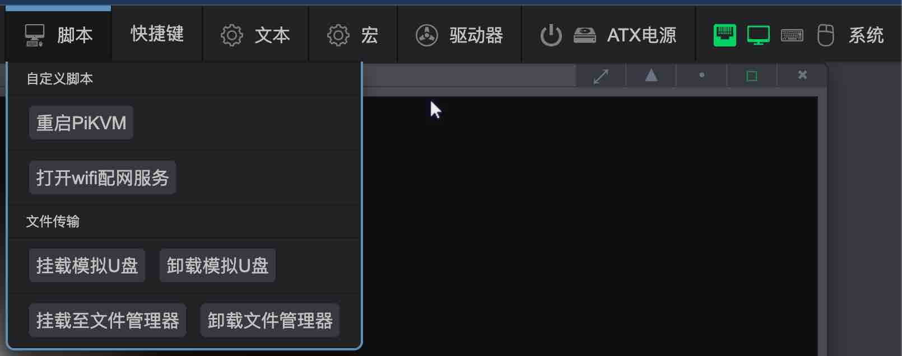

# 模拟U盘/文件传输

模拟U盘功能针对从没有网络的目标主机中**传出**或者通过浏览器将文件**传入**目标主机

实现该目标的逻辑与U盘在两台电脑之间拷贝文件一样，U盘插入A主机拷贝文件，然后再插入B主机获取文件

## 从目标主机中传出文件

### 将模拟U盘镜像插入目标主机

* 点击`脚本 -> 挂载模拟U盘`按钮将模拟U盘插入目标主机的操作，此时目标主机中会出现U盘的盘符

    {:width="800px" .off-glb}

    ??? tip "点击`挂载模拟U盘`实现了一键执行下列的操作，如果您想挂载其他自定义的模拟U盘镜像，可以参照下列步骤(点击展开)"

        * 首先挂载模拟U盘镜像，打开 `驱动器` 选项卡将驱动器模式选择为 `Flash`

            {:width="800px" .off-glb}

        * 下拉镜像菜单选中U盘镜像

            {:width="800px" .off-glb}

        * 将 `可写` 开关打开至 `on`

            {:width="800px" .off-glb}

        * 点击 `连接` 将镜像挂载至目标主机

            {:width="800px" .off-glb}

        * 点击 `系统` 选项卡,将 `OTG连接到目标主机` 开关调整到 `off` 状态，点击 `ok` ,来模拟U盘拔出

            {:width="800px" .off-glb}

        * 再将 `OTG连接到目标主机` 开关调整到 `on` 状态,来模拟U盘插入，此时可以看到驱动器变成U盘

            {:width="800px" .off-glb}

### 从目标主机中向模拟U盘中拷贝文件

* 模拟U盘镜像挂载后,可以将需要传出的文件放入U盘中

    {:width="800px" .off-glb}

* 待文件拷贝完成后,点击`脚本 -> 卸载模拟U盘`或者点击`驱动器 -> 断开`,使模拟U盘从目标主机中拔出

    {:width="800px" .off-glb}

    {:width="800px" .off-glb}

### 将模拟U盘插入到OPiKVM中

* 模拟U盘"插入"到OPiKVM中后，需要将其挂载到文件管理器的目录下才可以从浏览器访问模拟U盘内的文件

    使用`脚本 -> 挂载至文件管理器`按钮快捷操作

    {:width="800px" .off-glb}

    ??? tip  "点击`挂载至文件管理器`将会执行下列的操作，如果您想挂载其他自定义的模拟U盘镜像，可以参照下列步骤(点击展开)"

        * 打开 `终端` 切换至 root ，使用以下指令将U盘挂载至`文件管理器`目录下

        ```bash
        #输入root密码切换至管理员权限
        su -
        #将U盘镜像挂载至filebrowser中
        mount-filebrowser -i /var/lib/kvmd/msd/USB-flash.img
        ```

### 打开文件管理器下载模拟U盘内的文件

* 打开`系统 -> 文件管理器`

    {:width="300px" .off-glb}

* 在新开的窗口中选中文件下载至本地

    {:width="800px" .off-glb}

* 等待下载完成后,点击`脚本 -> 卸载文件管理器`,至此文件从目标主机中导出完成

    {:width="800px" .off-glb}

    ??? tip "点击`卸载文件管理器`将会执行下列的操作(点击展开)"

        在 `终端` 中输入命令取消 `文件管理器` 挂载

        ```bash
        su -
        umount /mnt
        ```
        {:width="800px" .off-glb}

## 向目标主机传入文件

* 将上述传出文件流程反过来即可，大致步骤为

    1. 挂载文件管理器
    2. 上传文件
    3. 卸载文件管理器
    4. 挂载模拟U盘至目标主机
    5. 从模拟U盘中拷贝文件至目标主机
    6. 卸载模拟U盘

## 希望模拟更大的U盘?

那就创建一个更大的U盘,以4GB为例（注意大小不能超过SD卡的容量）

```bash
#输入root密码切换至管理员权限
su -

#创建U盘镜像
make-flash.sh -p /var/lib/kvmd/msd/Flash-Customer.img -s 4 -t ntfs

```
