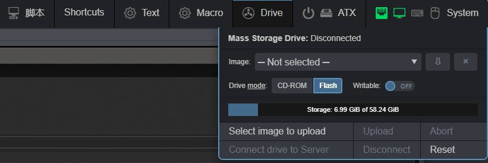
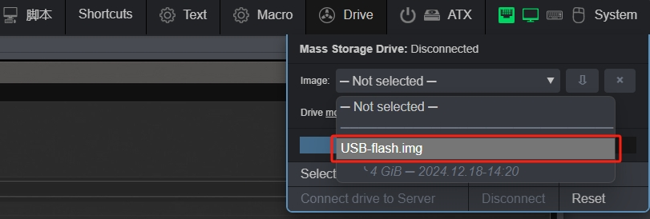
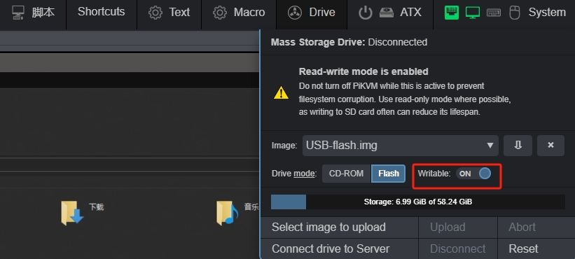
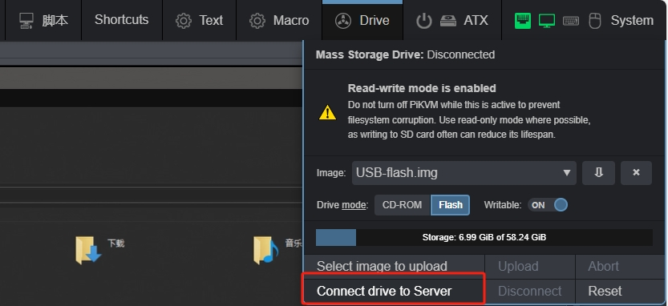
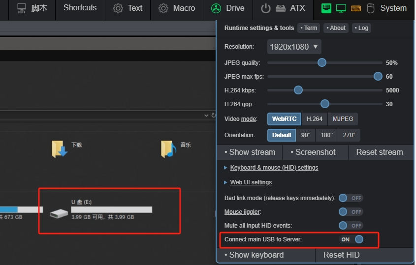
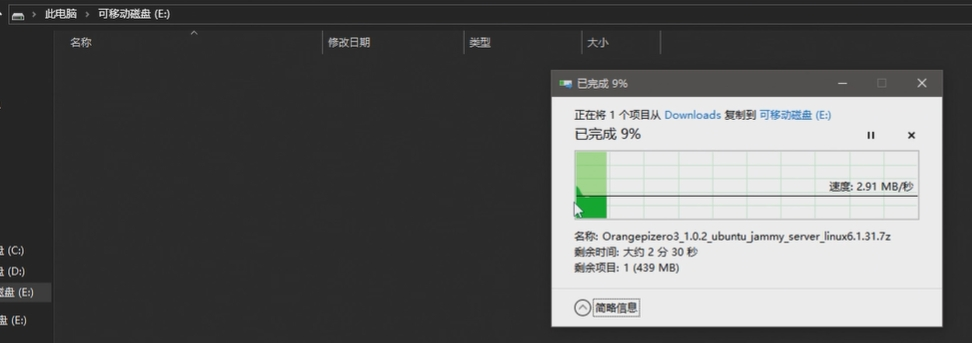
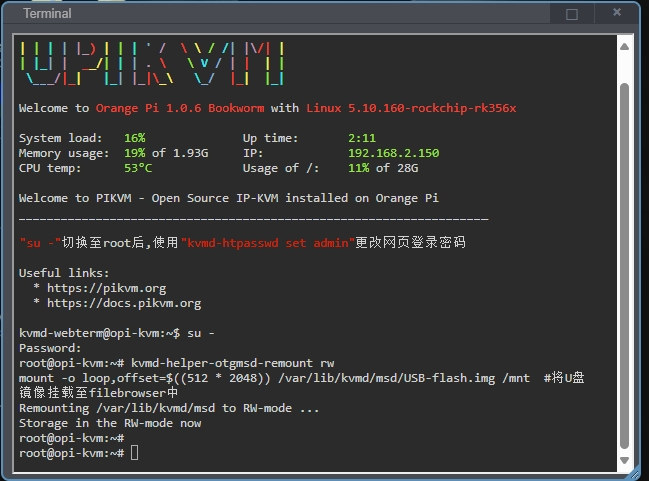
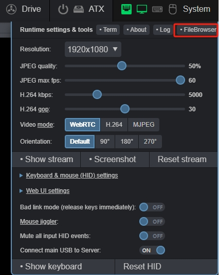
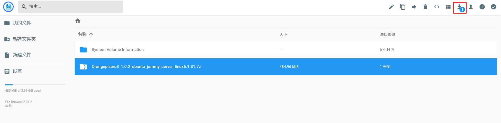
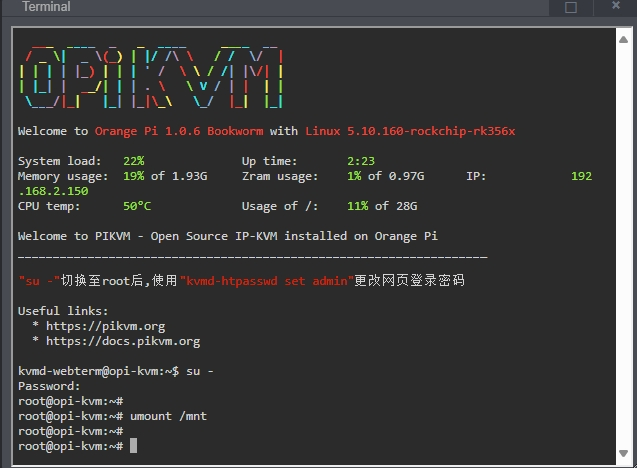

# 模拟U盘

模拟U盘功能针对从没有网络的目标主机中**传出**或者通过浏览器将文件**传入**目标主机

* 首先挂载模拟U盘镜像，打开`驱动器`选项卡将驱动器模式选择为`Flash`

{:width="800px" .off-glb}

* 下拉镜像菜单选中U盘镜像

{:width="800px" .off-glb}

* 将`可写`开关打开至`on`

{:width="800px" .off-glb}

* 点击`连接`将镜像挂载至目标主机

{:width="800px" .off-glb}

!!! tip "但是此时目标主机上挂载的类型仍然为CD-ROM类型，我们需要通过以下操作让目标主机识别驱动器类型已经更新"

* 点击`系统`选项卡,将`将主USB连接到目标主机`开关调整到`off`状态，点击`ok`,来模拟U盘拔出

{:width="800px" .off-glb}

* 再将`将主USB连接到目标主机`开关调整到`on`状态,来模拟U盘插入，此时可以看到驱动器变成U盘

{:width="800px" .off-glb}

## 从目标主机传出

* U盘镜像挂载后,可以将需要传出的文件放入U盘驱动器中，500M文件写入大约需要3分钟

!!! tip "受到WINDOWS系统对vfat分区格式的不友好,导致速度写入维持在3MB/s,如果模拟U盘分区格式为WINDOWS友好的NTFS,那么在Linux取出的时候又会变得**不友好**,该问题只能等待内核升级解决"

{:width="800px" .off-glb}

* 待文件拷贝完成后,取消U盘挂载

{:width="800px" .off-glb}

* 打开`终端`切换至root，使用以下指令将U盘挂载至FileBrowser目录下

```bash
su -   #输入root密码切换至管理员权限
```

```bash
kvmd-helper-otgmsd-remount rw
mount -o loop,offset=$((512 * 2048)) /var/lib/kvmd/msd/USB-flash.img /mnt  #将U盘镜像挂载至filebrowser中
```

{:width="800px" .off-glb}

* 打开`系统`->`FileBrowser`

{:width="800px" .off-glb}

* 在新开的窗口中选中文件下载至本地

{:width="800px" .off-glb}

* 等待下载完成后,在`终端`中输入命令取消`FileBrowser`挂载,至此文件从目标主机中导出完成

```bash
su -
umount /mnt
```

{:width="800px" .off-glb}