# 设置静态IP地址

!!! warning "请不要通过修改/etc/network/interfaces配置文件的方式来设置静态IP地址"

## 使用nmtui命令来设置静态IP地址

打开`终端`,`su -`切换到管理员执行`nmtui`指令

然后选择`Edit a connection`并按下回车键

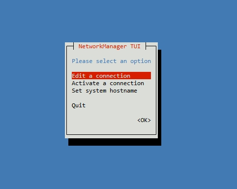{:width="800px" .off-glb}

然后选择需要设置静态IP地址的网络接口，比如设置Ethernet接口的静态IP地址选择`Wired connection 1`就可以了

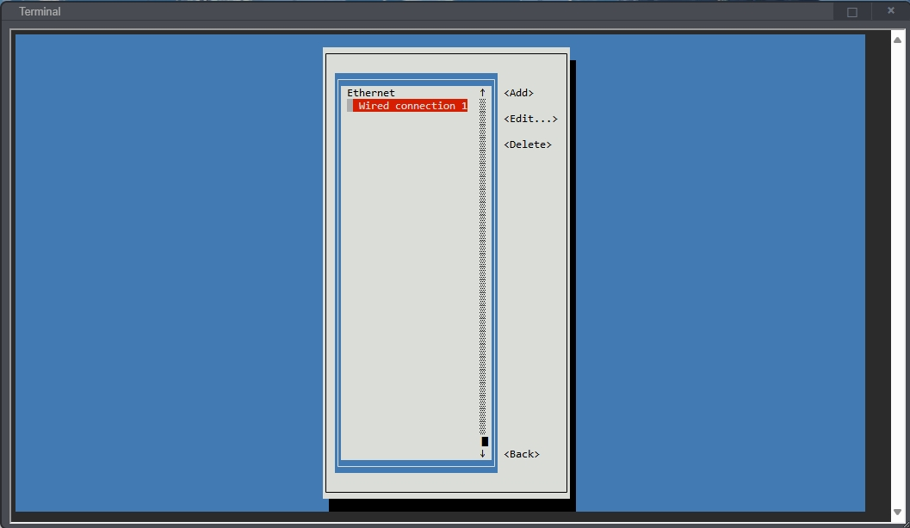{:width="800px" .off-glb}

然后通过`Tab`键选择`Edit`并按下回车键

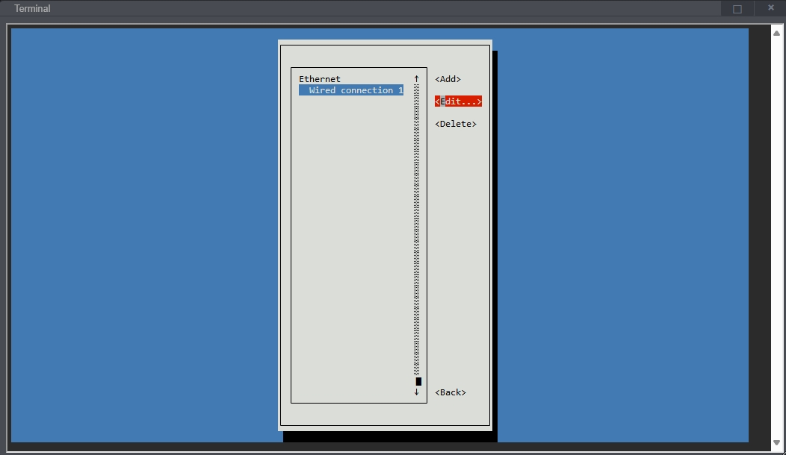{:width="800px" .off-glb}

然后通过`Tab`键将光标移动到下图所示的`<Automatic>`位置进行IPv4的配置

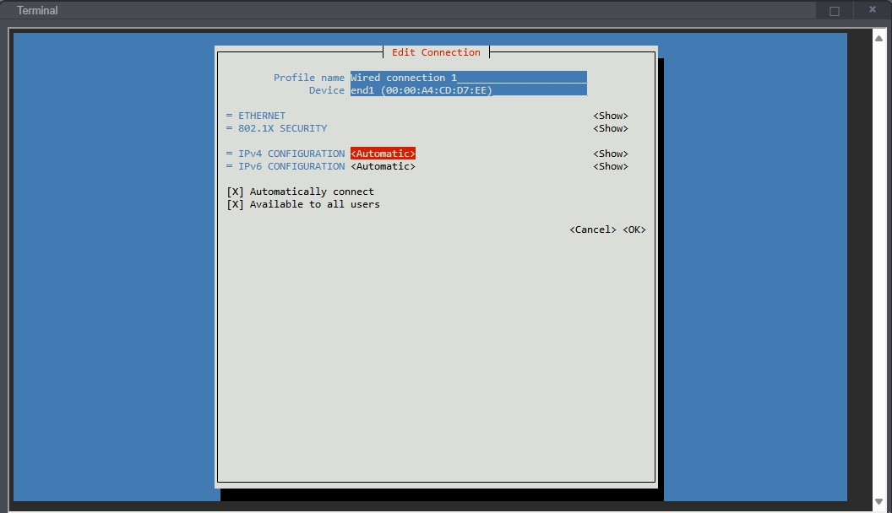{:width="800px" .off-glb}

然后回车,通过上下方向键选择`Manual`,然后回车确定

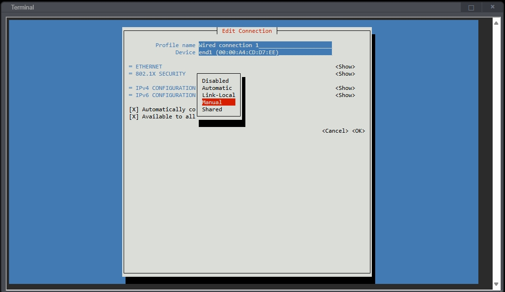{:width="800px" .off-glb}

然后通过`Tab`键将光标移动到`<Show>`

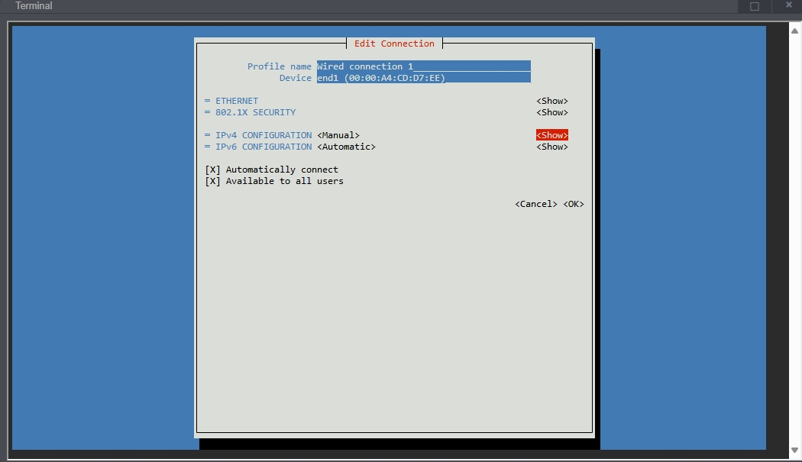{:width="800px" .off-glb}

然后回车,回车后会弹出下面的设置界面

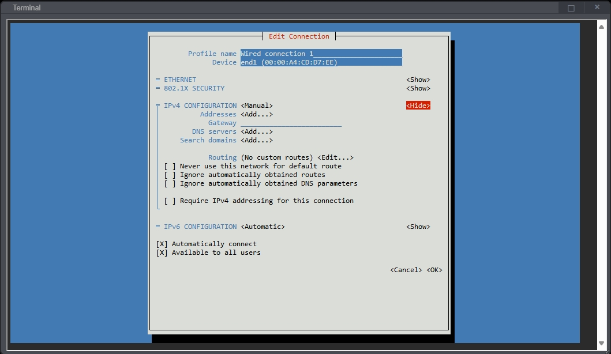{:width="800px" .off-glb}

然后就可以在下图所示的位置设置IP地址(Addresses)、网关(Gateway)和DNS,设置完后将光标移动到右下角的`<OK>`,然后回车确认

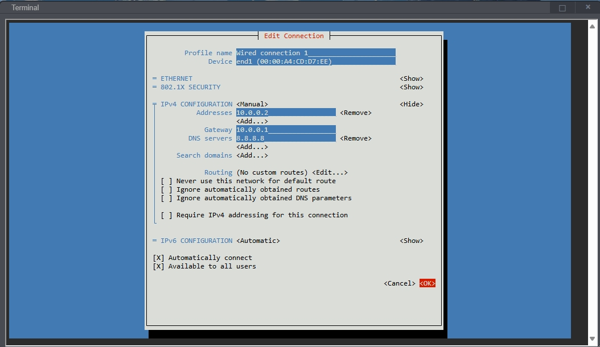{:width="800px" .off-glb}

然后点击`<Back>`回退到上一级选择界面,选择`<>QUIT`退出

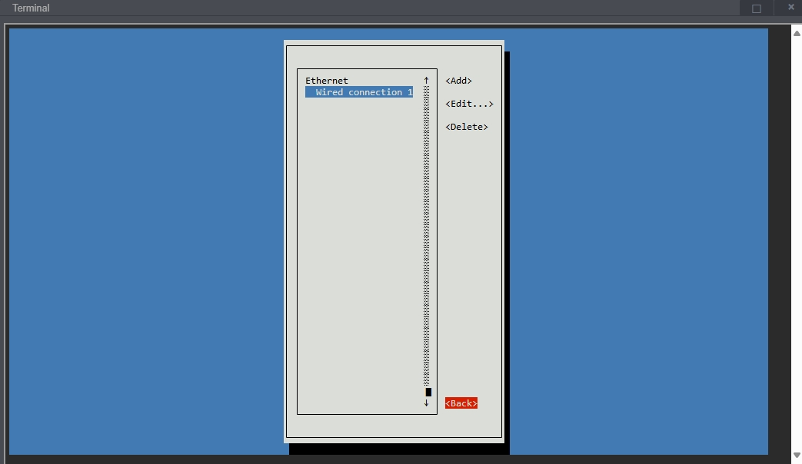{:width="800px" .off-glb}

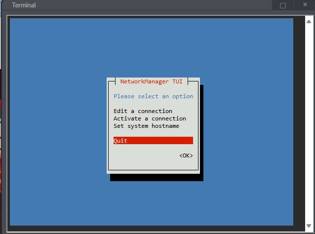{:width="800px" .off-glb}

!!!warning "reboot重启PiKVM后使配置生效"

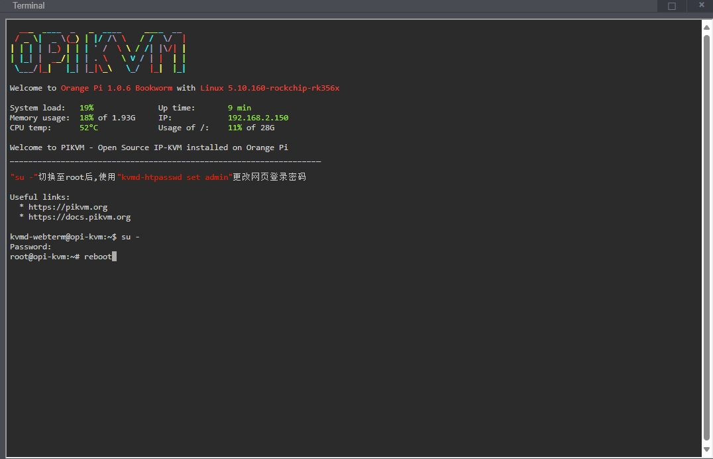{:width="800px" .off-glb}