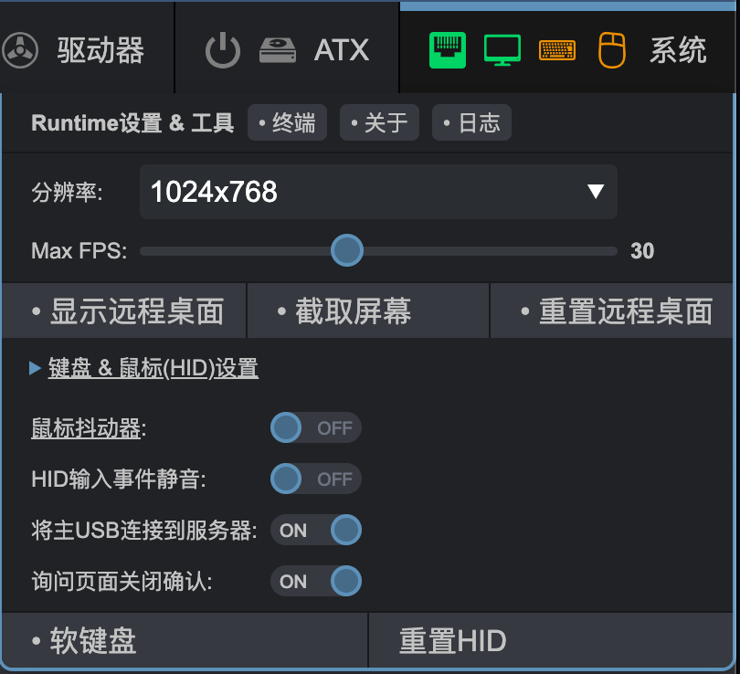
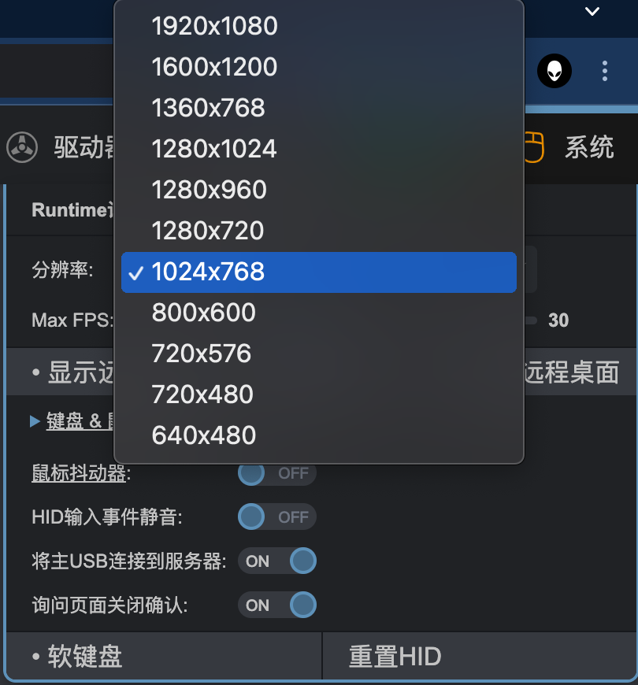

# 系统设置

!!! info

    系统设置包含显示设置和鼠标键盘设置以及其它设置,大部分时间这里使用默认设置即可，更多设置请参考官方手册

    - https://docs.pikvm.org/
    - https://github.com/pikvm/pikvm

| 查看Web UI中的“系统”菜单 |
|----------------------------------------|
| {:width="400px" .off-glb} |

-----

## 显示设置

- `分辨率`下拉菜单选择分辨率，进行分辨率的调整，最大支持1920x1080 30FPS

    {:width="400px" .off-glb}

    !!! tips "默认分辨率为1024*768 最大FPS30，如果想要修改PiKVM默认分辨率，请参考"

        * SSH或者[Web终端](login.md/#web-terminal)登录PiKVM
        * 使用`vi`或`nano`修改配置文件`/etc/kvmd/override.yaml`

            ```yaml
            kvmd:
                streamer:
                    resolution:
                        default: 1024x768
            ```

            对vi nano不熟悉的同学使用下面指令,将1920x1080替换成列表中你想要默认的分辨率
            ```console
            sed -i 's/1920x1080/1024x768/g' /etc/kvmd/override.yaml
            ```

        * 重启kvmd服务,使修改生效
        ```console
        systemctl restart kvmd
        ```

- 某些情况下你将远程桌面媒体流的窗口关闭后，可以使用`系统` > `显示远程桌面`重新打开远程桌面窗口

- `系统` > `截取屏幕`可以对远程桌面截屏

-----

## 鼠标抖动器

- 有时，如果你需要防止远程主机自动进入休眠状态，可以将`鼠标抖动器`开关打开

-----

## 将OTG连接到目标主机

- 极少数情况下，你可能会遇到需要将PiKVM与远程主机相连的USB端口断开重新插入以便远程主机重新识别USB的操作
`将OTG连接到目标主机`这个开关则赋予了你物理层面上断开/连接 Pikvm与远程主机的USB连接(HID、MSD)的功能
