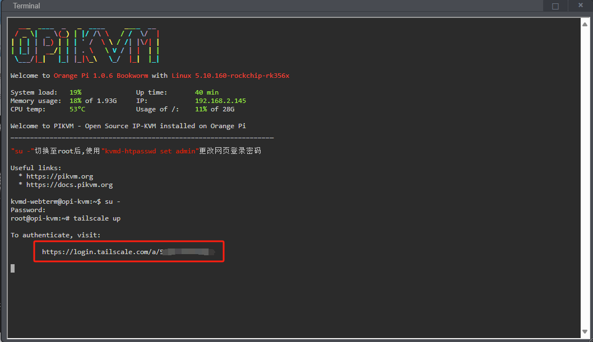

# Tailscale

[Tailscale VPN](https://tailscale.com/)可用于快速搭建从互联网访问OPiKVM的虚拟专用网络,相较于端口转发具有更高的安全性。
Tailscale是一种方便且免费(个人使用)的工具，用于建立小型专属私有网络。

基本的Tailscale配置命令如下所示。
有关详细说明，请参阅[Tailscale 支持](https://tailscale.com/contact/support/)。

-----

## PiKVM端配置

1. PiKVM侧启动tailsacale客户端。

    !!! warning "OPiKVM CM4已经预装客户端,不用安装客户端,直接使用tailscale up开启tailscale"

    ```sh
    tailscale up
    ```

2. `tailscale up`后会出现一个tailscale的登录URL,使用浏览器打开地址登录您的tailscale账户即可将PIKVM加入到您的tailscale网络中.

    你可以对PiKVM主机设置key永不过期[disable key expiry](https://tailscale.com/kb/)

    {:width="800px" .off-glb}

3. 身份验证成功后,对PiKVM进行重启确认一切运行正常。

    ```console
    [root@pikvm ~]# reboot
    ```

4. 查看tailscale接口IP地址:

    ```console
    [root@pikvm ~]# ip addr show tailscale0
    ```

    如果一切顺利,PiKVM就加入了您的VPN网络中.

    !!! warning "如果您在没有VPN的情况下无法访问PiKVM,请不要对Tailscale进行更新"
        遗憾的是,有时更新Tailscale客户端可能会因重大更改而导致网络问题。
        这些是Tailscale端的兼容性问题。
        更新时请注意这一点。

-----

## 客户端配置

* [下载](https://tailscale.com/download)并安装Tailscale客户端
    到您正在使用的系统(不是您要控制的系统)。
* 查看[Tailscale 管理页面](https://login.tailscale.com/admin/machines)查看您的VPN网络。
* 按照网络浏览器中的`URL:“https://<tailscale_kvm_ip>`,您将看到PiKVM web界面。

-----

## 卸载

如果出现一些故障导致网络不可用,通常的建议是从PiKVM中完全删除Tailscale并执行全新安装:

```sh
#卸载tailscale

su -
apt-get remove -y tailscale
rm -rf /var/lib/tailscale /var/cache/tailscale
reboot

#重新安装tailscale

su -
apt-get update
apt-get install tailscale

```

<!-- curl -fsSL https://pkgs.tailscale.com/stable/ubuntu/jammy.noarmor.gpg | sudo tee /usr/share/keyrings/tailscale-archive-keyring.gpg >/dev/null
curl -fsSL https://pkgs.tailscale.com/stable/ubuntu/jammy.tailscale-keyring.list | sudo tee /etc/apt/sources.list.d/tailscale.list -->