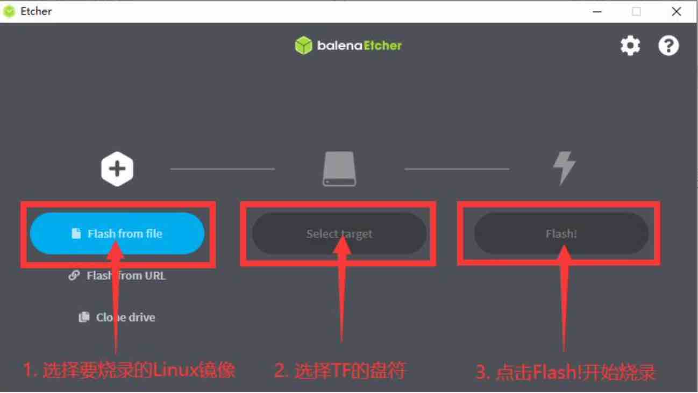

# 更新系统

当您发现首页有了新的版本需要更新时，可以按照下列流程对您的OPiKVM进行系统升级

!!! note "准备工作"

    * 读卡器
    * 烧录软件balenaEtcher或者Rufus

!!! note "镜像下载地址"

    * OPiKVM Zero3:百度网盘:https://pan.baidu.com/s/1TdOHb8n919HN9NJ6BFJ_OA?pwd=3yvl 提取码：3yvl

    * OPiKVM CM4:百度网盘:https://pan.baidu.com/s/1WLU8PWNLYQHd7MqJCvai-g?pwd=x31u 提取码: x31u

---

## 使用balenaEtcher烧录镜像的具体步骤如下所示

* 关闭PiKVM的电源，关闭电源前记得备份好您的个性化设置

* 取出TF卡槽内的TF卡，将其插入读卡器中并将读卡器插入电脑中

* 首先选择要烧录的镜像文件的路径

* 然后选择TF卡的盘符

* 最后点击Flash就会开始烧录Linux镜像到TF卡中

{:width="600px" .off-glb}

* 成功烧录完成后balenaEtcher的显示界面如下图所示，如果显示绿色的指示图标 说明镜像烧录成功，此时就可以退出balenaEtcher，然后拔出TF卡插入到开发板的TF卡槽中使用了。

{:width="600px" .off-glb}

* PiKVM插入电源开机，等待系统升级完成，这个过程大约需要20分钟左右，待oled屏幕显示ip地址后，升级完成

---
