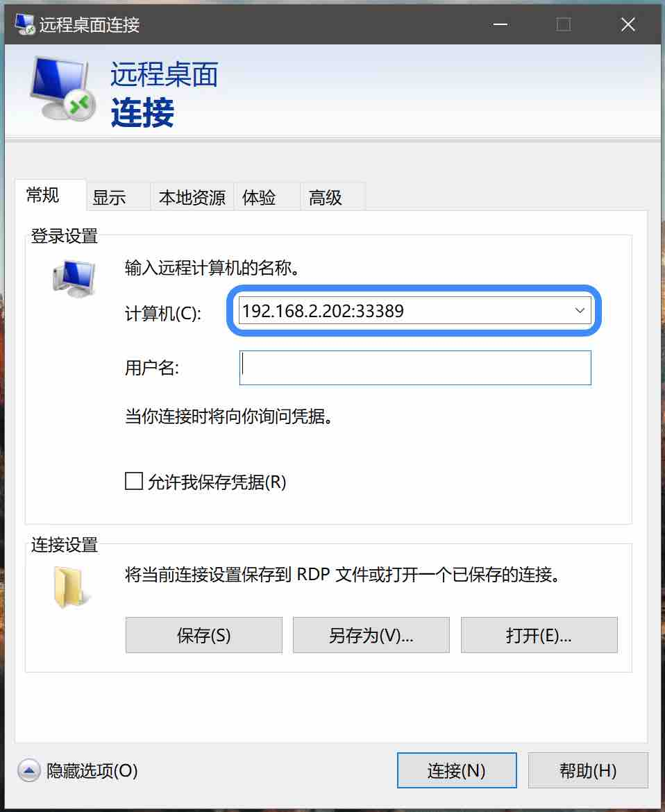

# USB 以太网

该功能可以模拟USB网卡，便可以为目标主机提供以太网络连接。

结合DNS服务器、FTP或SMB等配置，可大幅扩展OPiKVM功能。

-----

## 基本配置

{!_usb_limits.md!}

!!! info

    在浏览本页之前，建议先阅读 [OPiKVM 配置指南](config.md)
    以便了解术语以及以下参数的具体作用方式。

1. 编辑 `/etc/kvmd/override.yaml` 并添加以下内容：

    ``` yaml
    otg:
        devices:
            ethernet:
                enabled: true
                driver: ncm
                host_mac: 48:6f:73:74:50:43
                kvm_mac: 42:61:64:55:53:42
    ```

    `enabled: true` 用于启用 USB 网络。其余参数的含义在下表中描述。

    | 参数         | 默认值      | 描述                                      |
    |-------------|-------------|-----------------------------------------|
    | `host_mac`  | `<random>`  | 主机侧网络接口的 MAC 地址。             |
    | `kvm_mac`   | `<random>`  | OPiKVM 端名为 `usb0` 的网络接口 MAC 地址。|
    | `driver`    | `ecm`       | USB 网络协议驱动。针对不同操作系统需选用不同驱动，见下表。|

    | 驱动     | 操作系统兼容性                        |
    |---------|--------------------------------------|
    | `ecm`   | Linux；Mac OS                        |
    | `eem`   | Linux                                |
    | `rndis` | Windows >= 7 <sup>[*1*](#rndis)</sup>；Linux > 2.6.13    |
    | `ncm`   | Windows >= 10；Linux > 2.6.37；Mac OS |

    <a name="rndis">*1*</a>：*使用rndis驱动时，无法同时开启附加大容量存储驱动器，但是不影响默认的MSD大容量存储*

2. 建议使用 `kvmd-otgnet` 服务在主机端自动配置 USB 网络。
    该服务会配置防火墙、分配地址到本地 OPiKVM 接口 `usb0`，并启动 DHCP，使目标主机获取 IPv4 地址。

    默认情况下，`usb0` 接口会被分配 `172.30.30.1/24`。
    当主机通过 DHCP 请求时，会从网络 `172.30.30.0/24` 中分配一个地址给主机。

    出于安全考虑，主机到 OPiKVM 侧的所有入站连接均被阻止（仅允许 ICMP 和 UDP 67 端口的 DHCP 请求）。
    若需允许主机访问 OPiKVM 接口，需要在 `/etc/kvmd/override.yaml` 中添加如下注释：

    ```yaml
    otgnet:
        firewall:
            allow_tcp: [80, 443]
    ```

    其他实用的防火墙选项如下：

    | 参数             | 默认值     | 描述                                               |
    |-----------------|-----------|--------------------------------------------------|
    | `allow_icmp`    | `true`    | 是否允许 ICMP 到 OPiKVM。                           |
    | `allow_tcp`     | `[]`      | 允许从主机到 OPiKVM 的 TCP 端口列表。               |
    | `allow_udp`     | `[]`      | 允许从主机到 OPiKVM 的 UDP 端口列表。               |
    | `forward_iface` | `<none>`  | OPiKVM 用于网络转发的默认网关接口（见下文）。         |

    更多参数和命令请通过 `kvmd -m` 查阅。

3. 使用命令启用该服务：

    `kvmd-otgnet` 服务与 `opikvm-hotspot` 热点服务存在冲突，在开启该服务前，确认热点服务关闭

    ```sh
    systemctl disable --now opikvm-hotspot
    systemctl enable kvmd-otgnet
    ```

4. 执行重启：
    ```sh
    reboot
    ```

## 通过 OPiKVM 进行路由

默认情况下，`kvmd-otgnet` 仅支持 OPiKVM 与目标主机间通信。
通过 USB 以太网功能，目标主机无法访问 OPiKVM 之外的其他主机。
如需主机访问外部网络（通过USB以太网功能），需要在 `/etc/kvmd/override.yaml` 中进行额外配置。

1. 在 `firewall` 下添加 `forward_iface: <接口名>`，用于指定转发请求的网络接口（默认网关）。
    通常若使用内置以太网口，则为 `end1`：

    ```yaml
    otgnet:
        firewall:
            forward_iface: end1
    ```

2. 添加 DNS 服务器以提供主机名解析服务。
    例如，使用 `8.8.8.8` 作为 DNS 服务器，可通过 `dnsmasq` DHCP 选项实现：

    ```yaml
    otgnet:
        commands:
            post_start_cmd_append:
            - "--dhcp-option=6,8.8.8.8"
    ```

3. 将上述两项合并：

    ```yaml
    otgnet:
        firewall:
            forward_iface: end1
        commands:
            post_start_cmd_append:
            - "--dhcp-option=6,8.8.8.8"
    ```

4. 若需为目标主机启用Internet访问，添加：

    ```yaml
     otgnet:
        iface:
            net: 10.65.0.0/28
    ```

    `net` 参数定义了 `usb0` 网络的 IP 地址范围。主机会自动从该网段获取 IP 地址及上述 DNS 服务器。
    注意：此网段不应与 OPiKVM 所在网络相同。

    更多参数和命令请通过 `kvmd -m` 查阅。

5. 重启OPiKVM

??? example "以下示例展示了一个既能访问 OPiKVM 又可上网的主机配置："

    ```yaml
    otgnet:
        firewall:
            allow_tcp: [80, 443]
            forward_iface: end1
        commands:
            post_start_cmd_append:
                - "--dhcp-option=6,1.1.1.1,1.0.0.1"
        iface:
            ip_cmd:
                - /usr/bin/ip
            net: 10.65.0.0/28
    ```

## RDP远程桌面协议代理

依靠 OPiKVM 的 nginx 服务，我们可以为目标主机创建简单的 RDP 代理服务

1. 添加以下配置 USB 以太网功能并开启 RDP 代理

    !!! info
        使用 RDP 代理功能时，目标主机系统版本：

        windows 10 建议使用 rndis 驱动

        windows 11 建议使用 ncm 驱动

        如果不开启 RDP 代理功能，windows 10/11 都建议使用 ncm 驱动

    ```yaml
    otg:
        devices:
            ethernet:
                enabled: true
                driver: ncm
                host_mac: 48:6f:73:74:50:43
    otgnet:
        commands:
            post_start_cmd_append:
                - --dhcp-host=48:6f:73:74:50:43,{dhcp_ip_end},server
        firewall:
            allow_tcp: [80, 443]
    nginx:
        rdp:
            enabled: true
    ```

2. 重启OPiKVM

    ```sh
    reboot
    ```

3. 通过远程桌面访问目标主机

    填写 OPiKVM 的 IP 地址加上 33389 端口号

    用户名为目标主机 windows 登录名，进行访问

    {:width="300px" .off-glb}
