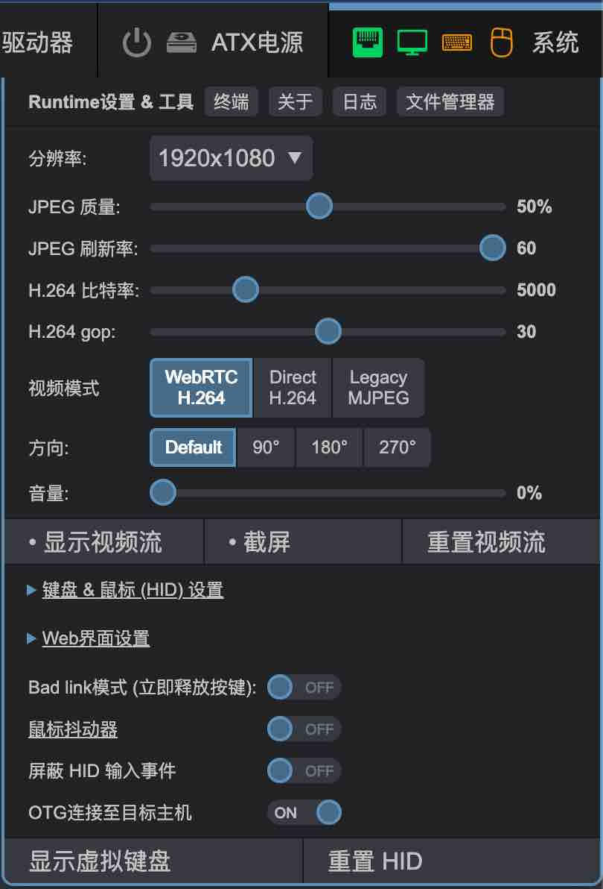

# 视频模式

PiKVM提供了三种视频流模式。本页面解释了它们之间的主要区别，并帮助你获得最佳的视频性能。

视频模式可以在 Web UI 的 **系统** 菜单中切换。如果你没有看到切换选项，可能是你的浏览器不支持 H.264 视频。

{:width="350px" .off-glb}

!!! tip "快速提示"

    * 网络良好时：使用 `WebRTC` 或 `Direct` 模式，并设置 `H.264 gop = 0`。

    * 网络差且使用 `WebRTC` 模式时：设置 `H.264 gop = 30`。

    * 网络差且使用 `Direct` 模式时：设置 `H.264 gop = 0`。

    * 如果 `WebRTC` 模式无法工作，尝试使用 `Direct` 模式。

    * `Direct` 模式暂不支持音频。

-----

## 设置

* **H.264 kbps** *(比特率)* - 数值较大时，视频质量更好，但网络流量会增加。

* **H.264 gop** *(图像组)* - 在两个帧之间，必须强制添加一个参考帧。推荐的值如上所述。

-----

## WebRTC H.264 模式

这是默认模式。它使用高效的 H.264 编码来节省流量。
视频通过 WebRTC 协议进行流式传输，你可能在使用 Discord 或 Google Chat 的视频通话时遇到过此协议。
由于 WebRTC 不使用 HTTP 传输视频，建立连接相对复杂（但 PiKVM 会自动处理 99% 的情况）。

!!! info "优点 / 缺点"

    * ✅ 支持所有现代浏览器。

    * ✅ 提供 [双向音频](audio.md)。

    * ❌ 由于网络连接差（如移动互联网、差的 Wi-Fi 等），视频可能丢失，
        或由于路由器设置导致 WebRTC 的优先级较低。

    * ❌ 在某些网络中可能完全被屏蔽。

    * ❌ 由于 WebRTC 处理的特殊性，有时延迟可能会略有增加。

-----

## Direct H.264 模式

PiKVM 引入的新实验性模式，用于实时流式传输。
它也使用 H.264 编码，但通过常规 HTTP (WebSocket) 传输视频。

!!! info "优点 / 缺点"

    * ✅ 在网络差的情况下非常稳定，比 WebRTC 更好（根据我们的测试和用户反馈）。

    * ✅ 不会被防火墙屏蔽，因为它看起来像是普通的 HTTPS 流量。

    * ✅ 延迟也很低且稳定。

    * ❌ 当前不支持音频（但未来会支持）。

    * ❌ 某些 [老旧浏览器](https://caniuse.com/webcodecs) 不支持此模式所需的 WebCodes。

-----

## 传统 MJPEG 模式

传统的 Motion JPEG。自古以来，IP 摄像头就通过这种方式将视频流传输到浏览器。
该流是一个无限的 JPEG 队列，通过 `` HTML 标签进行替换。
如果之前的模式正常工作，现在使用它就没有意义了。

!!! info "优点 / 缺点"

    * ✅ 有时 H.264 在浏览器中由于操作系统许可限制被禁用（例如在 Red Hat Linux 或 Debian 中）。
        但是 MJPEG 总是可以正常工作。

    * ✅ 不会被防火墙屏蔽，因为它看起来像是普通的 HTTPS 流量。

    * ✅ 如果网络良好，延迟较低。

    * ❌ 不支持音频。

    * ❌❌❌ 消耗大量流量。没有 Wi-Fi、没有移动网络，只有有线连接才能正常工作。

-----

## 如果浏览器完全不支持 H.264

某些 Linux 发行版需要更多的配置才能使用 H.264，这可能包括任何 RedHat 或 Debian 变体。以下是一些示例：

    * 在 Fedora 上使用 Chromium 时，可以连接 [RPM Fusion](https://rpmfusion.org) 仓库，
    然后安装 `chromium-freeworld` 包来替代 `chromium`。

    * 在 Debian GNU/Linux 和 Firefox 上，确保 OpenH264 插件存在并已启用。
    按 `Ctrl+Shift+A` 打开 `附加组件管理器`，然后点击 `插件`。你应该看到
    *OpenH264 视频编解码器由 Cisco Systems, Inc. 提供*。
    确保通过按 "更多选项" 按钮（三个点），然后点击 `始终启用` 来启用它。

-----

<!-- ## 视频录制

目前，无法通过 Web UI 以方便的方式录制视频，但可以通过控制台的小技巧来录制没有声音的视频。
仅支持那些支持 H.264 视频的 PiKVM 型号。

??? example "从终端录制视频"

    1. 更新操作系统：

    2. 安装 `ffmpeg` 包并重启：

        ```console
        [root@pikvm ~]# rw
        [root@pikvm ~]# pacman -S ffmpeg
        [root@pikvm ~]# reboot
        ```

    3. 重启后，再次使用 `rw` 命令将文件系统切换为可写模式。

    4. 要录制视频，打开 Web UI（即流应该正在运行）或通过 VNC 连接。
        然后，在当前目录中运行录制命令：

        ```console
        [root@pikvm ~]# ustreamer-dump --sink kvmd::ustreamer::h264 --output - | ffmpeg -use_wallclock_as_timestamps 1 -i pipe: -c:v copy my_video.mp4
        ```

    5. 按 `Ctrl+C` 停止录制，别忘了使用 `ro` 命令将文件系统切换为只读模式。

??? example "从终端截屏"

    要截图，像之前的示例那样将文件系统切换为可写模式，并运行流。

    然后，执行截图命令：

    ```console
    [root@pikvm ~]# curl --unix-socket /run/kvmd/ustreamer.sock http://localhost/snapshot -o /tmp/screen.jpg
    ``` -->
