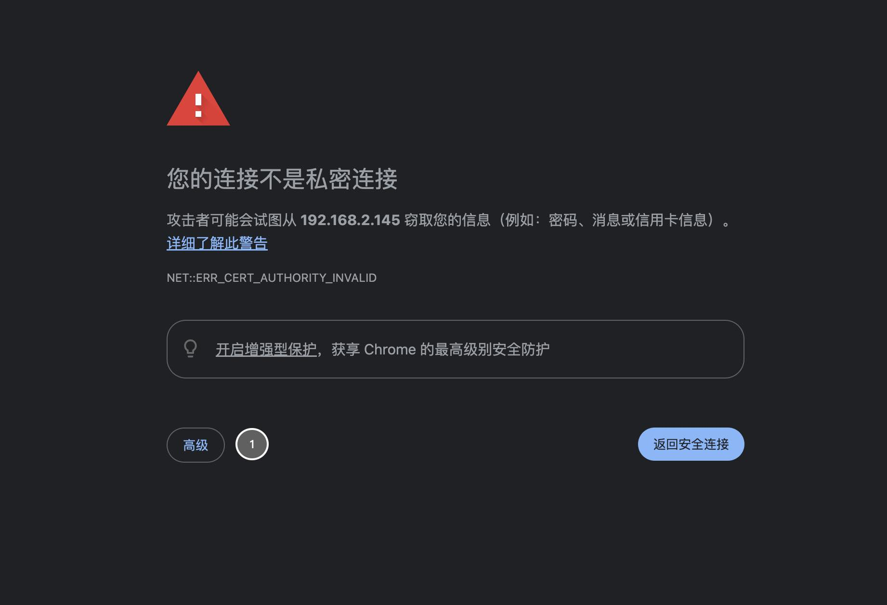
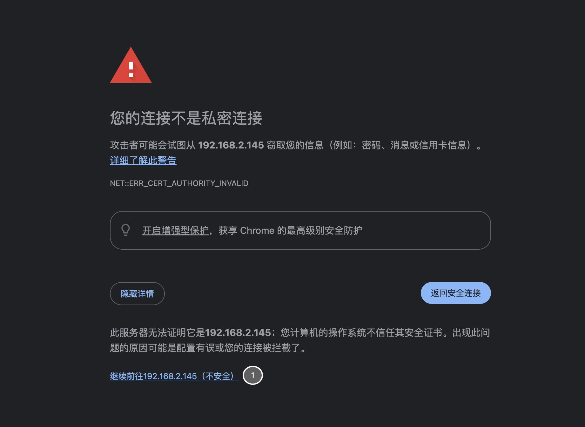
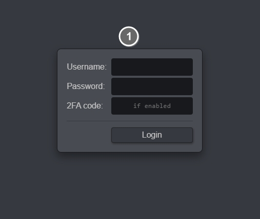
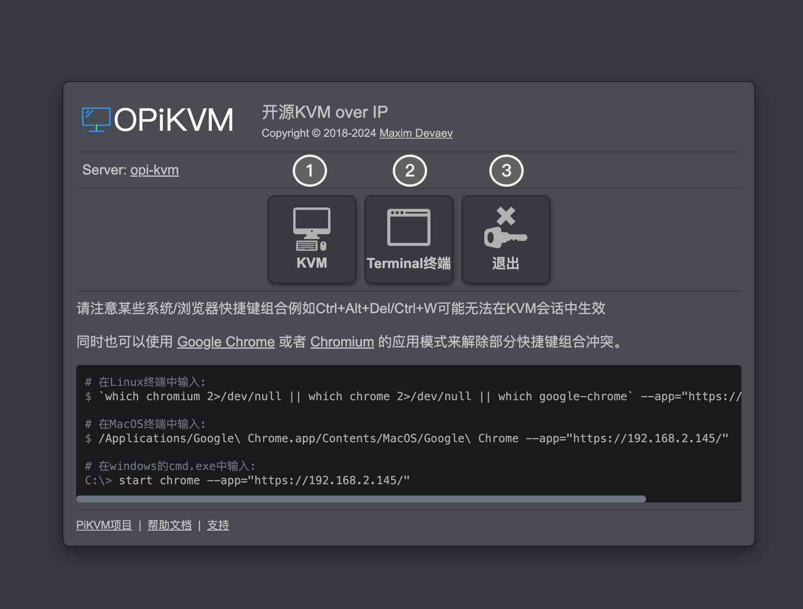
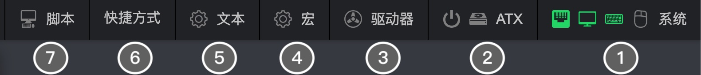
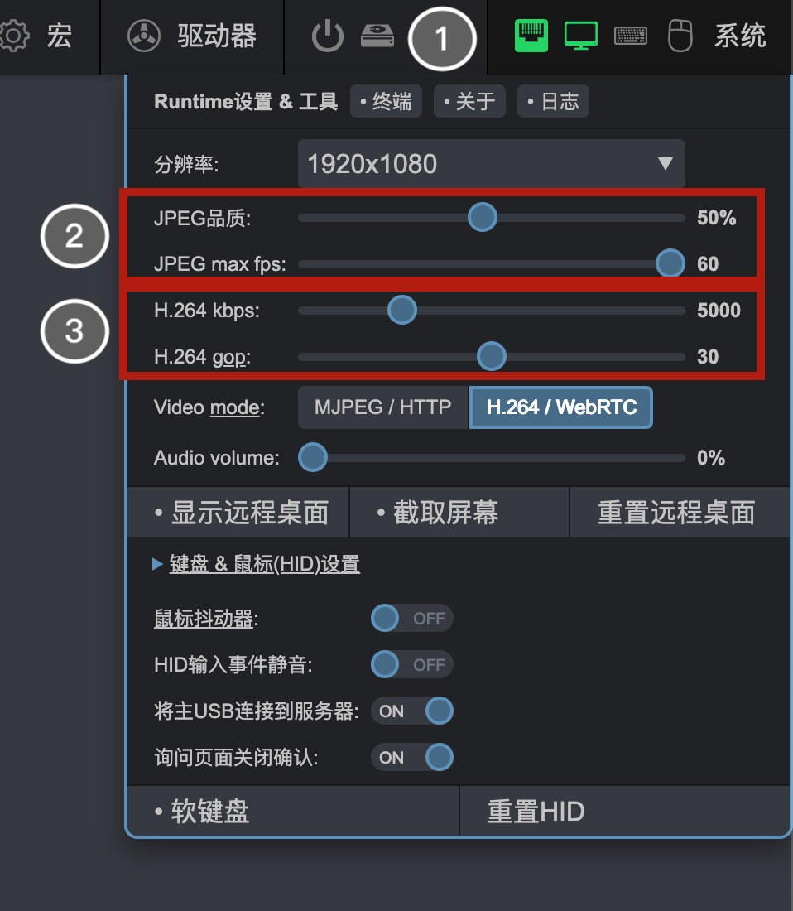
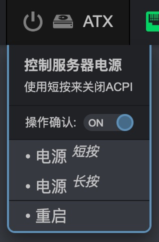
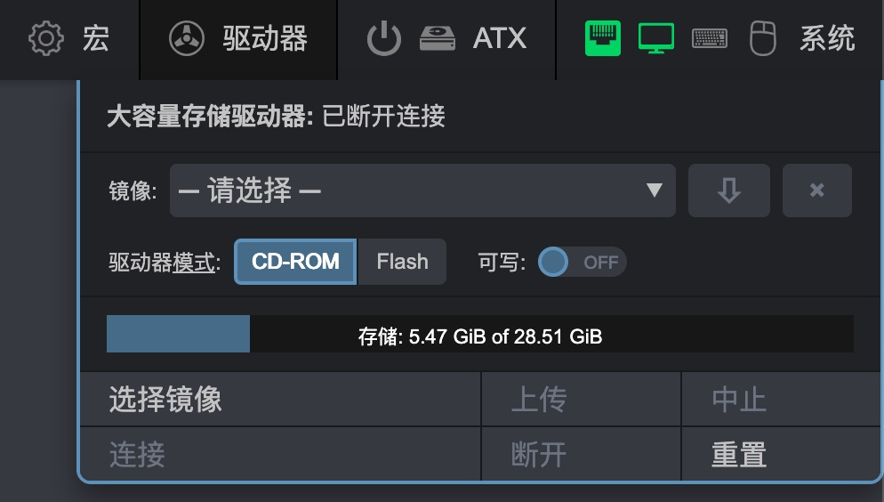

## WebUI

按照文档首次启动后，浏览器访问OPiKVM地址(以Chrome为例)

{:width="500px" .off-glb}

点击 高级/Advanced

{:width="500px" .off-glb}

点击 继续访问/Proceed

!!! note "账号密码位于**左侧首次**启动文档中"

{:width="500px" .off-glb}

填写账号密码，如果您开启了2FA验证也请填入2FA验证码.

{:width="500px" .off-glb}

??? note "展开查看说明"

    1. 访问被控系统的显示输出
    2. 打开web终端
    3. 退出登录

{:width="500px" .off-glb}

??? note "展开查看说明"

    1. 系统设置, 更多详细信息将在下文介绍
    2. ATX控制状态, 只有正确接线才能工作
    3. MSD驱动器选项卡
    4. 宏选项卡，可以录制宏
    5. OCR功能，OCR会识别错误，请在最终确定前检查
    6. 你可以在这里找到大部分快捷方式(目前仅限windows)(不可编辑)
    7. 自定义脚本

{:width="500px" .off-glb}

??? note "展开查看说明"
    1. 系统图标

        以太网信号 = PiKVM网络连接状态

        显示信号 = 目标主机有活动显示信号

        键盘/鼠标活动信号 = 键盘/鼠标活动信号

    2. ONLY for MJPEG mode
    3. ONLY for H.264 (WebRTC) mode

{:width="200px" .off-glb}

1. ATX电源操作

{:width="400px" .off-glb}

1. MSD镜像上传/挂载

<!-- 

1. Please read and understand this section
2. This is where you can upload or Download your scripts

!!! note
    This is not like VNC/AnyDesk/TeamViewer as these are software solutions, this is a hardware solution therefor cannot change the behavior of the target system.
    This does not act like a clipboard

1. This will allow you to paste text to the target system - Be mindful whats being pasted to the target and how
2. This will allow you to ONLY copy text from the target - Be mindful that OCR will do its best to recognize text but may fail at it

1. This is an expanded view and shows the shortcuts for mostly Windows -->
