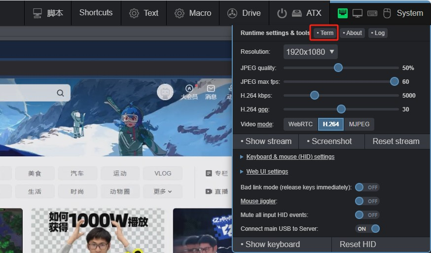
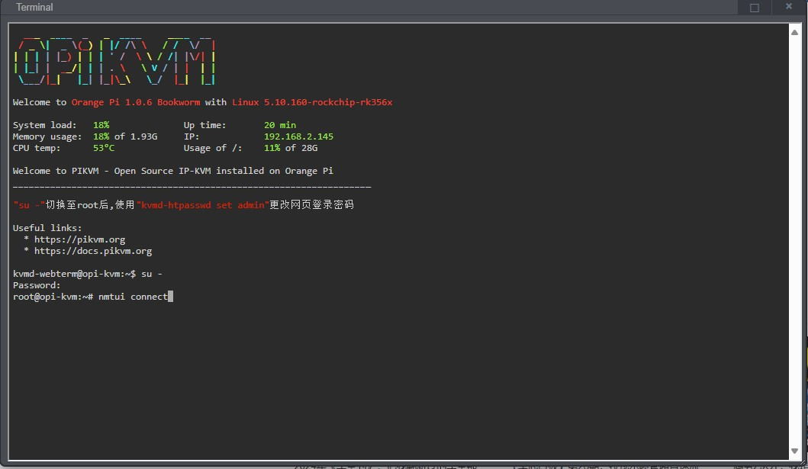
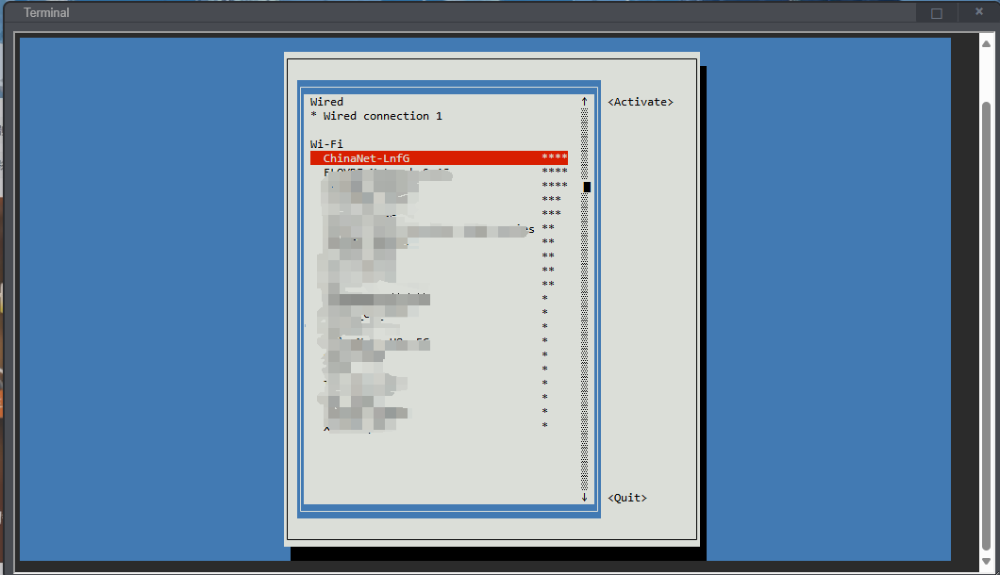
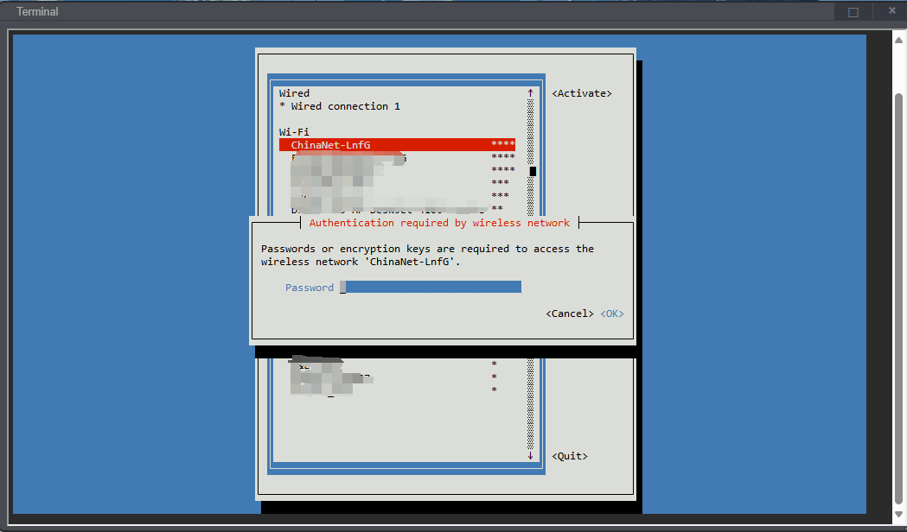

# 如何连接WIFI

进入KVM后选择右上角`系统`-> `终端`,进入终端命令行

{:width="800px" .off-glb}

执行`su -`并输入root密码后切换到管理员,输入以下命令打开网络管理

```bash
su -
nmtui connect
```

{:width="800px" .off-glb}

使用 ↑ ↓ 键选择对应的wifi,回车输入密码连接到对应wifi

{:width="800px" .off-glb}

{:width="800px" .off-glb}
