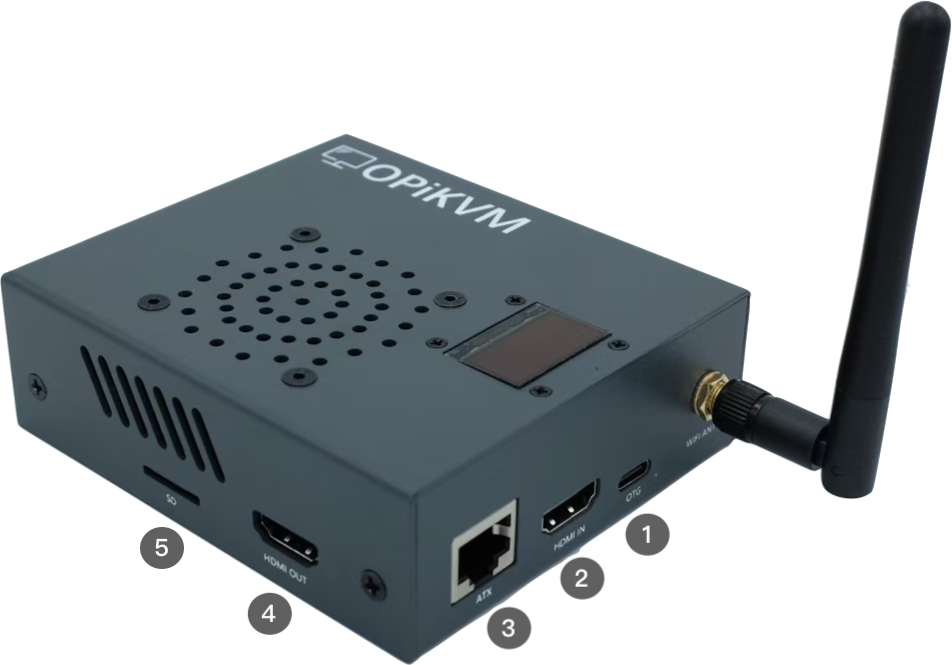
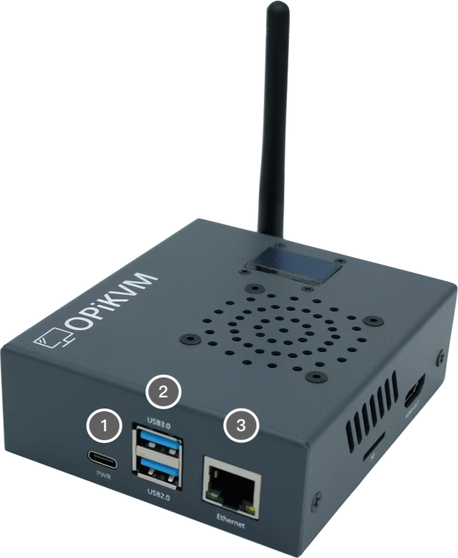
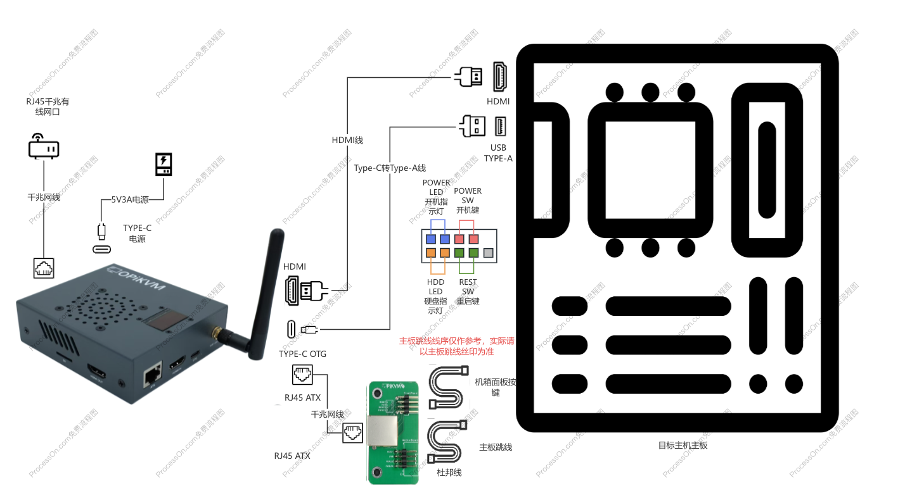

# OPiKVM CM4

---

## OPiKVM CM4接口

{:width="600px" .off-glb}

1. OTG接口，连接目标主机的USB接口
2. HDMI IN接口，连接目标主机HDMI输出接口
3. ATX接口，使用RJ45 8芯网线连接ATX小板
4. HDMI OUT口，直通接口连接显示器
5. SD卡槽

{:width="500px" .off-glb}

1. TYPE-C电源接口
2. USB接口
3. 以太网口

---

## 将OPiKVM连接至目标主机

