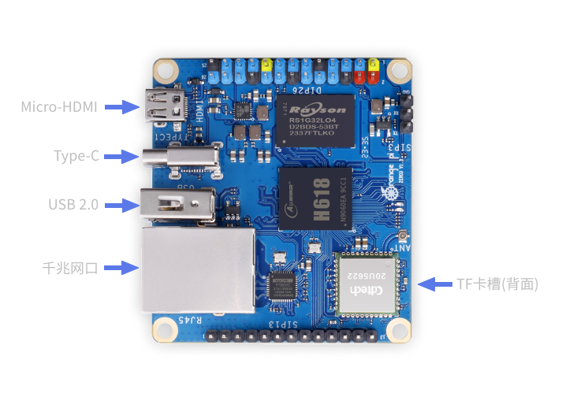
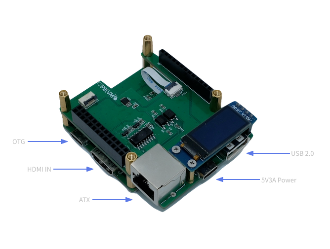
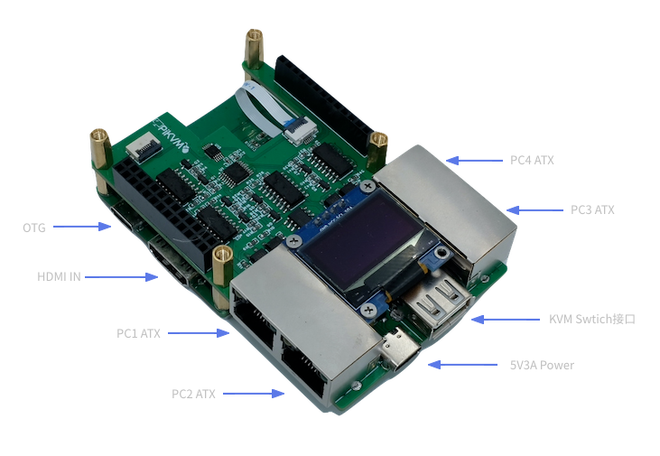
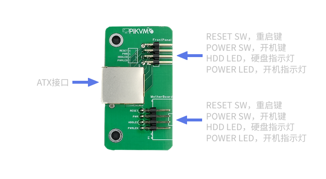
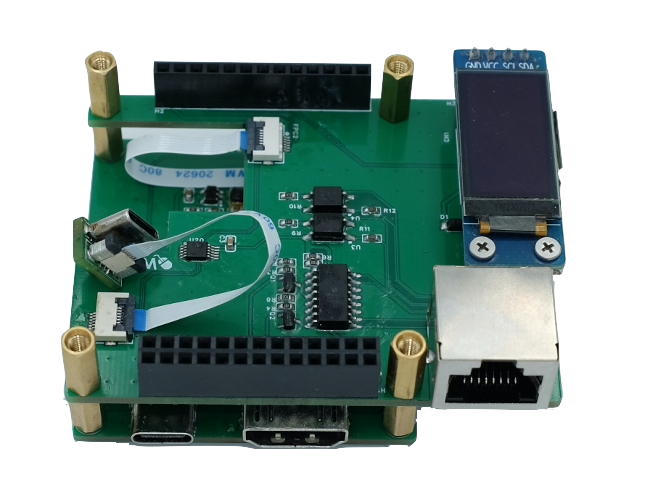
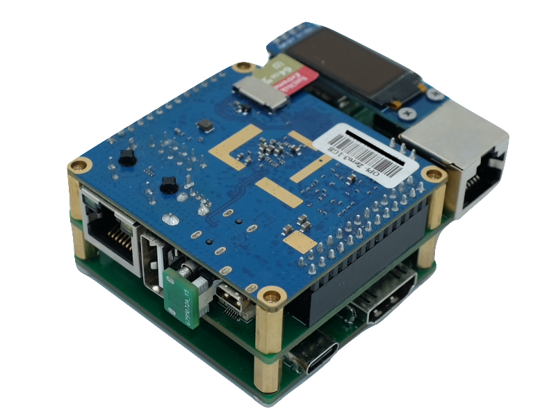
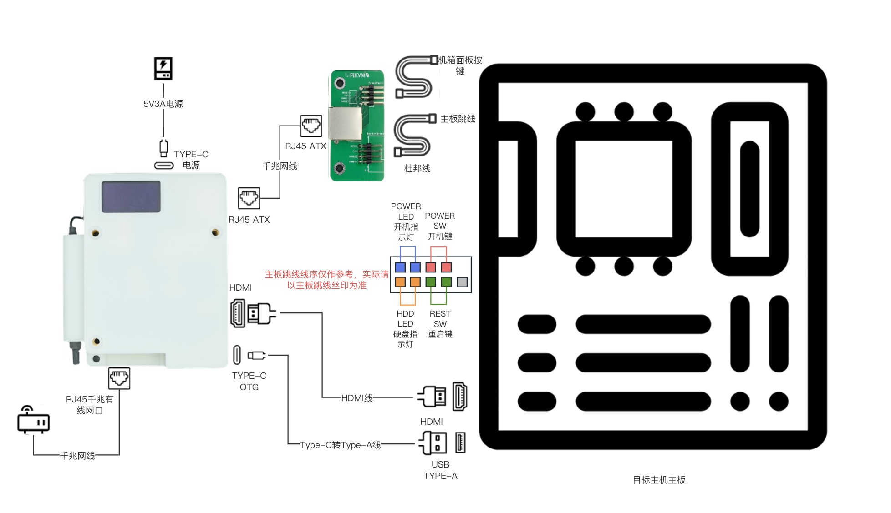
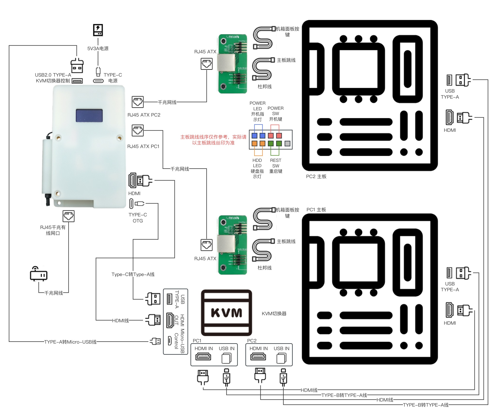

# OPiKVM Zero3

-----

## OPiKVM Zero3接口

{:width="600px" .off-glb}

- Type-C用于连接至HAT的FPC接口
- 千兆网口用于接入网络

-----

## HAT扩展板接口

### 1ATX版本

{:width="600px" .off-glb}

- OTG接口用于连接目标主机USB接口
- HDMI IN接口用于连接目标主机HDMI接口
- ATX接口用于连接ATX电源控制板
- 5V3A TYPE-C接口用于连接电源
- USB2.0为预留接口

### 4ATX版本

{:width="700px" .off-glb}

- OTG接口用于连接目标主机USB接口
- HDMI IN接口用于连接目标主机HDMI接口
- ATX接口用于连接ATX电源控制板
- 5V3A TYPE-C接口用于连接电源
- KVM Swtich接口用于连接KVM切换器切换接口

-----

## ATX电源控制板接口

{:width="400px" .off-glb}

- ATX接口用于连接HAT ATX接口
- 8pin排针用于连接目标主机机箱的按键以及主板开机、重启、hdd led、power led pin

-----

## 将FPC转Type-C连接至HAT扩展板

{:width="400px" .off-glb}

- HAT侧FPC连接器底座为翻盖式，Type-C侧FPC连接器底座为抽屉式
- 软排线为6p，0.5mm，反向排线
- 注意排线插入底座方向

-----

## 将HAT扩展板安装至OrangePi Zero3主板上

{:width="500px" .off-glb}

-----

## 将OPiKVM连接至您的主机

- **1ATX版本**

- **4ATX版本**

